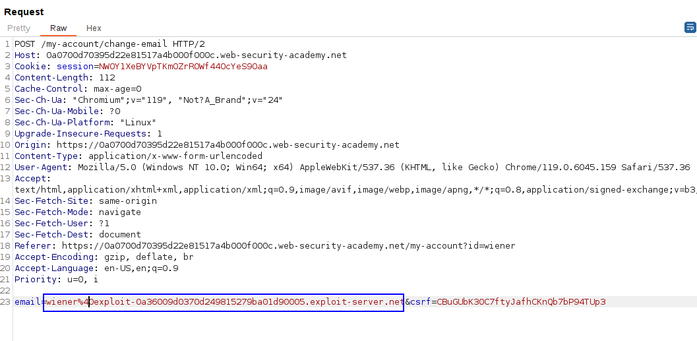
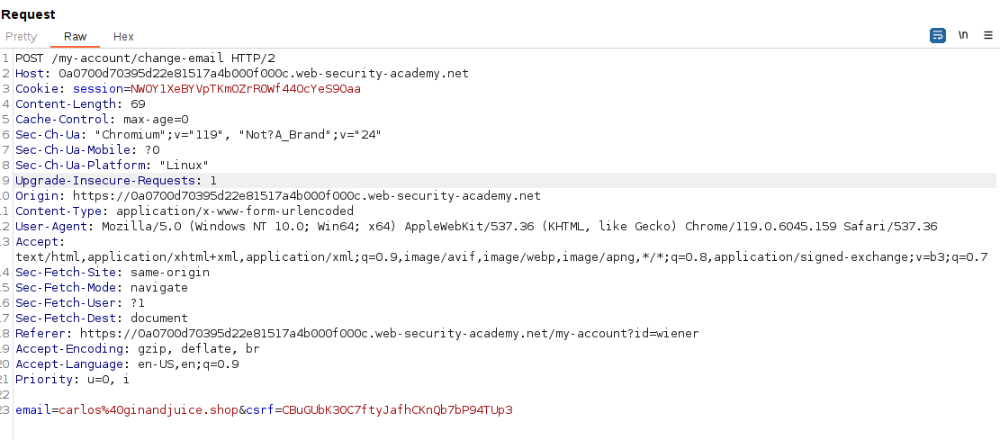
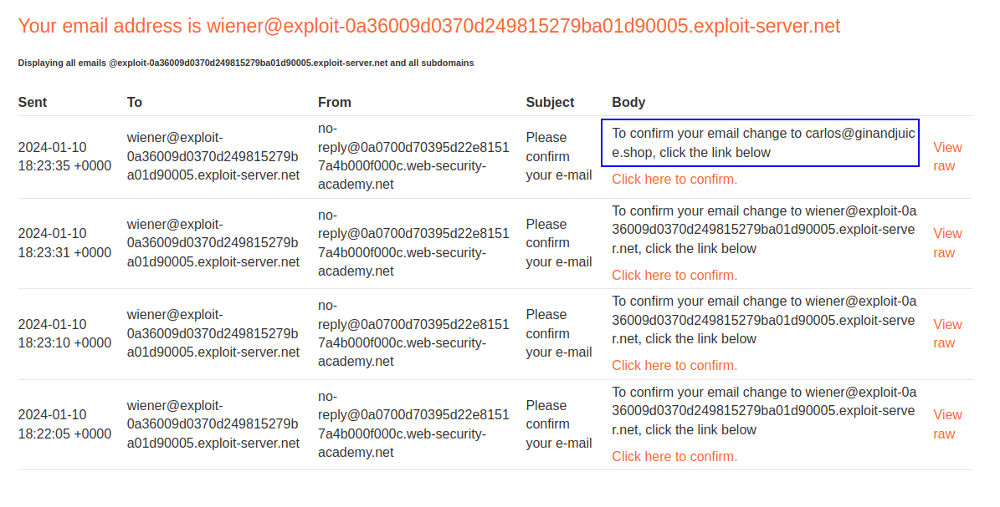
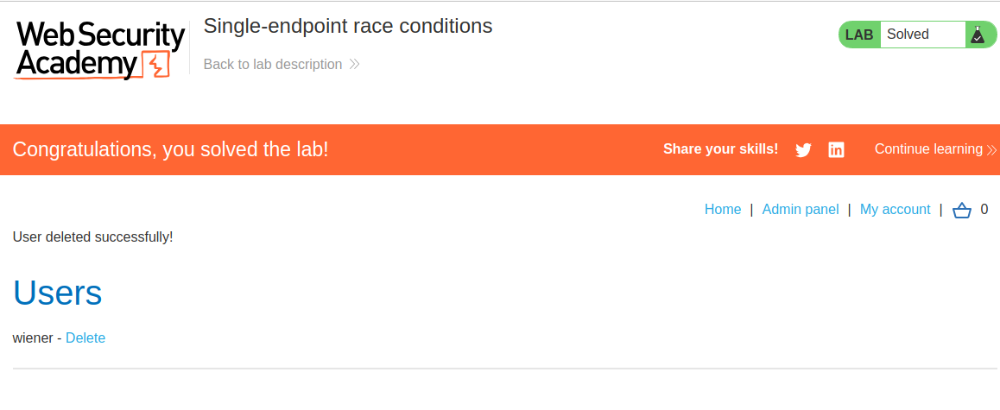

In this single endpoint we can reset the email address of an user. The thing is that we can perform a race injection by sending two requests of the same type in **PARALLEL**. 

What we want sending these two requests is to:

Take the email of the first request (our email)
Take the token of the second request (of the email associated to the victim).

As these two variables are global and are not performed atomically, we can perform a race condition over them.

The first request is a change to our email:

And the second to change for the victim's email:

Sending them in parallel a few times leads to the email being sent to our address but containing the victim's reset URL:

We can now reset the password and delete `carlos`.
