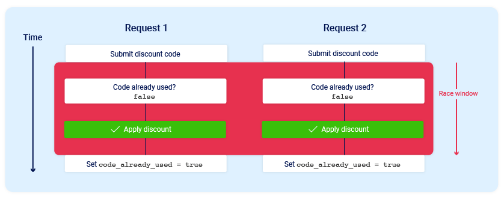
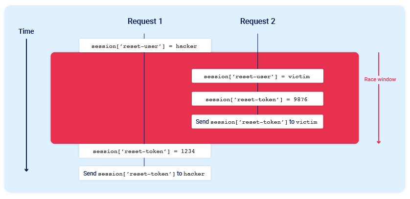

Race conditions is something related to the business logic vulnerabilities. Occurs when things process requests **concurrently without being able to manage properly concurrence.**

Race condition attacks can lead to multiple **distinct threads interacting with the same data** at the same time, resulting in a "collision" that causes an unintended behavior in the application.
A race condition attack uses carefully timed requests to cause intentional collisions and exploit this unintended behavior for malicious purposes.

The period of time during which a collision is possible is known as the "race window". This could be the fraction of a second between two interactions with the database, for example.
Like other logic flaws, the impact of a race condition is heavily dependent on the application and the specific functionality in which it occurs.

# Limit overrun race conditions 
The most well-known type of race condition enables you to exceed some kind of limit imposed by the business logic of the application.

For example, consider an online store that lets you enter a promotional code during checkout to get a one-time discount on your order. To apply this discount, the application may perform the following high-level steps:

1. Check that you haven't already used this code.
2. Apply the discount to the order total.
3. Update the record in the database to reflect the fact that you've now used this code.

If you later attempt to reuse this code, the initial checks performed at the start of the process should prevent you from doing this:


Now consider what would happen if a user who has never applied this discount code before tried to apply it twice at almost exactly the same time:

As you can see, the application transitions through a temporary sub-state; that is, a state that it enters and then exits again before request processing is complete. In this case, the sub-state begins when the server starts processing the first request, and ends when it updates the database to indicate that you've already used this code. This introduces a small race window during which you can repeatedly claim the discount as many times as you like.

There are many variations of this kind of attack, including:

- Redeeming a gift card multiple times
- Rating a product multiple times
- Withdrawing or transferring cash in excess of your account balance
- Reusing a single CAPTCHA solution
- Bypassing an anti-brute-force rate limit

Limit overruns are a subtype of so-called "time-of-check to time-of-use" (TOCTOU) flaws. Later in this topic, we'll look at some examples of race condition vulnerabilities that don't fall into either of these categories.

# Detecting and exploiting limit overrun race conditions with Turbo Intruder
In addition to providing native support for the single-packet attack in Burp Repeater, we've also enhanced the Turbo Intruder extension to support this technique. You can download the latest version from the [BApp Store](https://portswigger.net/bappstore/9abaa233088242e8be252cd4ff534988).

Turbo Intruder requires some proficiency in Python, but is suited to more complex attacks, such as ones that require multiple retries, staggered request timing, or an extremely large number of requests.

To use the single-packet attack in Turbo Intruder:
1. Ensure that the target supports HTTP/2. The single-packet attack is incompatible with HTTP/1.
2. Set the `engine=Engine.BURP2` and `concurrentConnections=1` configuration options for the request engine.
3. When queueing your requests, group them by assigning them to a named gate using the `gate` argument for the `engine.queue()` method.
4. To send all of the requests in a given group, open the respective gate with the `engine.openGate()` method.

```python
def queueRequests(target, wordlists):

    # if the target supports HTTP/2, use engine=Engine.BURP2 to trigger the single-packet attack
    # if they only support HTTP/1, use Engine.THREADED or Engine.BURP instead
    # for more information, check out https://portswigger.net/research/smashing-the-state-machine
    engine = RequestEngine(endpoint=target.endpoint,
                           concurrentConnections=1,
                           engine=Engine.BURP2
                           )

    passwords=wordlists.clipboard

    # the 'gate' argument withholds part of each request until openGate is invoked
    # if you see a negative timestamp, the server responded before the request was complete
     # the 'gate' argument withholds the final part of each request until engine.openGate() is invoked
    for password in passwords:
        engine.queue(target.req, password, gate='gate1')

    # once every request has been queued
    # invoke engine.openGate() to send them in sync
    engine.openGate('gate1')


def handleResponse(req, interesting):
    table.add(req)

```
For more details, see the `race-single-packet-attack.py` template provided in Turbo Intruder's default examples directory.

Here is the lab that bruteforces a login bypassing the rate limit using a race condition: [login_rate_limit_bypass](labs/login_rate_limit_bypass.md)

# Multi-endpoint race conditions

Perhaps the most intuitive form of these race conditions are those that involve sending requests to multiple endpoints at the same time.

Think about the classic logic flaw in online stores where you add an item to your basket or cart, pay for it, then add more items to the cart before force-browsing to the order confirmation page.

A variation of this vulnerability can occur when payment validation and order confirmation are performed during the processing of a single request. The state machine for the order status might look something like this:
In this case, you can potentially add more items to your basket during the race window between when the payment is validated and when the order is finally confirmed.

Here is a lab that covers that scenario, buying an item between the validation and the confirmation of the basket: [multi_endpoint_race_conditions](labs/multi_endpoint_race_conditions.md)

## Aligning multi-endpoint race windows
When testing for multi-endpoint race conditions, you may encounter issues trying to line up the race windows for each request, even if you send them all at exactly the same time using the single-packet technique.
This common problem is primarily caused by the following two factors:
- **Delays introduced by network architecture -** For example, there may be a delay whenever the front-end server establishes a new connection to the back-end. The protocol used can also have a major impact.
- **Delays introduced by endpoint-specific processing -** Different endpoints inherently vary in their processing times, sometimes significantly so, depending on what operations they trigger.

Fortunately, there are potential workarounds to both of these issues.
### Connection warming
Back-end connection delays don't usually interfere with race condition attacks because they typically delay parallel requests equally, so the requests stay in sync.

It's essential to be able to distinguish these delays from those caused by endpoint-specific factors. One way to do this is by "warming" the connection with one or more inconsequential requests to see if this smoothes out the remaining processing times. In Burp Repeater, you can try adding a `GET` request for the homepage to the start of your tab group, then using the **Send group in sequence (single connection)** option.

If the first request still has a longer processing time, but the rest of the requests are now processed within a short window, you can ignore the apparent delay and continue testing as normal.

If you still see inconsistent response times on a single endpoint, even when using the single-packet technique, this is an indication that the back-end delay is interfering with your attack. You may be able to work around this by using Turbo Intruder to send some connection warming requests before following up with your main attack requests.

### Abusing rate or resource limits
If connection warming doesn't make any difference, there are various solutions to this problem.

Using Turbo Intruder, you can introduce a short client-side delay. However, as this involves splitting your actual attack requests across multiple TCP packets, you won't be able to use the single-packet attack technique. As a result, on high-jitter targets, the attack is unlikely to work reliably regardless of what delay you set.

Instead, you may be able to solve this problem by abusing a common security feature.

Web servers often delay the processing of requests if too many are sent too quickly. By sending a large number of dummy requests to intentionally trigger the rate or resource limit, you may be able to cause a suitable server-side delay. This makes the single-packet attack viable even when delayed execution is required.

# Single endpoint race conditions
Sending parallel requests to a single endpoint with different values for each request can sometimes trigger powerful race conditions.

Imagine the procedure of a password reset, that stores the user ID and the user associated password reset token.

If we send a request to change a password with our user, the server will generate a token for the user. What if we send two requests in parallel, first to change the password for our user and then for other user? What could happens is that the `user` variable might be the value of the second request, but the value of the `token` might be extracted from the first one. For example, if this happens:


Here, both requests are sent in parallel, but there are made asyncronously, so the global variable `reset-user`is set from the second request at last (as it starts being `hacker` but then is overwritten from the second request) and same happens to the token, but viceversa. What we have is the scenario of the `victim` user but with the `attacker` token, which is sent to the attacker.

The problem, as we can see, is having global variables and operations that need to occur atomically, and do not occur atomically but are interrupted inbetween. In this case, the operation is duplicated and that is what causes problems, but in previous scenarios we had problems by **doing another things** inbetween the operations that "should" be atomic.

Here is a lab that covers this attack: [single_endpoint_email_reset_attack](labs/single_endpoint_email_reset_attack.md)

# Time-sensitive attacks
Sometimes you may not find race conditions, but the techniques for delivering requests with precise timing can still reveal the presence of other vulnerabilities.

One such example is when high-resolution timestamps are used instead of cryptographically secure random strings to generate security tokens.

Consider a password reset token that is only randomized using a timestamp. In this case, it might be possible to trigger two password resets for two different users, which both use the same token. All you need to do is time the requests so that they generate the same timestamp.


