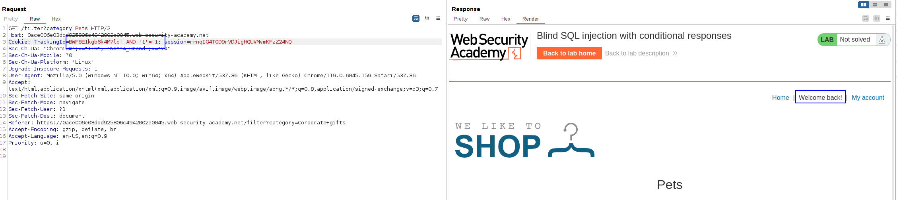
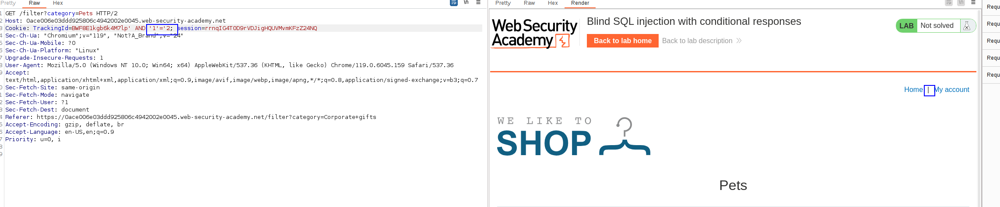
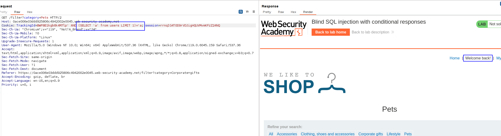
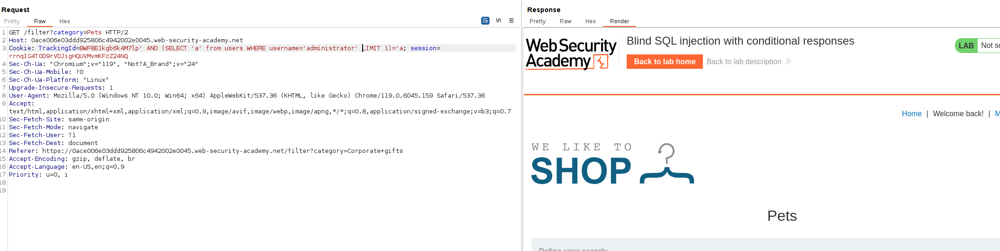
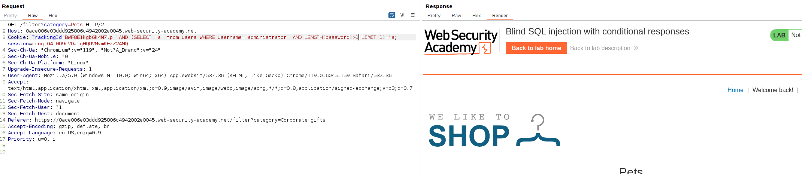
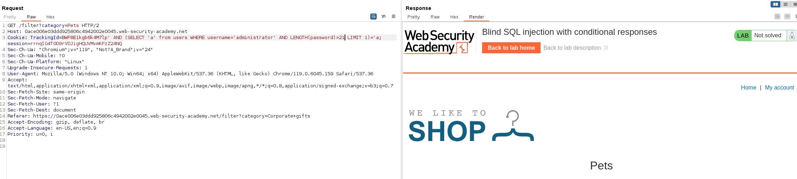
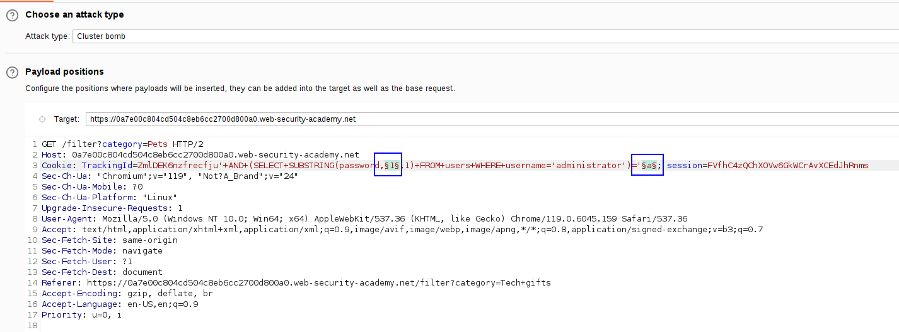
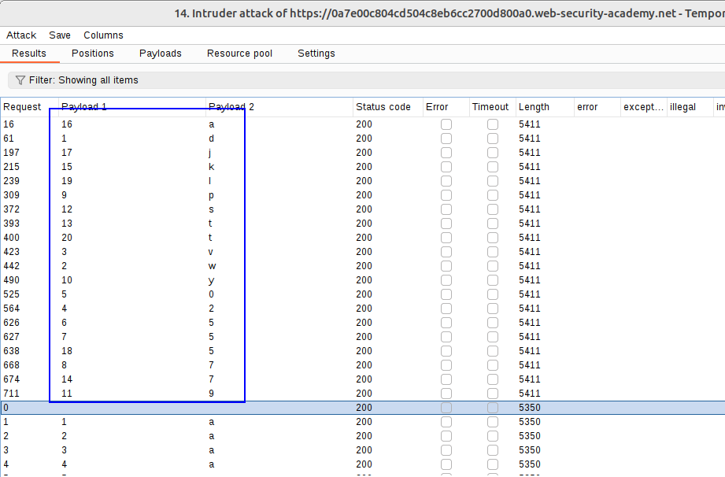
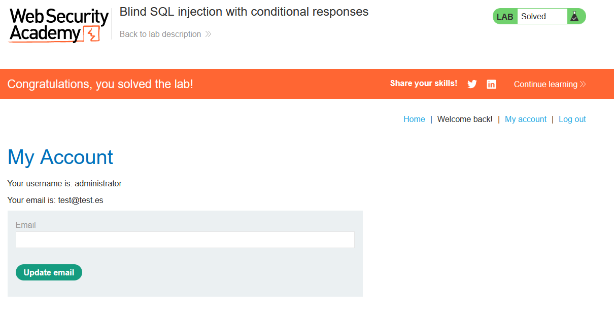

https://sandunigfdo.medium.com/blind-sql-injection-with-conditional-responses-d23ff6660299

The query use in the lab will look something like: 
`SELECT trackingId FROM someTable WHERE trackingId = '<COOKIE-VALUE>'`

We have to tamper with `trackingId`.

At this point we know we have an SQL injection:

And we also know it is blind because if we add a FALSE statement, we don't see that message:

We know have to check whether the table `users` exist.
With the following payload **we can check if a table exists:**
`' AND (SELECT 'a' from users LIMIT 1)='a;`
Because it will select the hardcoded value `a` from the table. If the table exists, the condition is true. If it does not exists, it will be false.

By making the SQL query a bit longer we can know if there is an user called `administrator`:
`' AND (SELECT 'a' from users LIMIT 1 WHERE username='administrator')='a;`
This will only be true IF users exists and if the administrator user ALSO exists.

The next step is to determine how many characters does the administrator password have.
We just add an AND statement that checks the length from 1 until we don't get the "Welcome back" error:
`' AND (SELECT 'a' from users WHERE username='administrator' AND LENGTH(password)>1 LIMIT 1)='a`
We change the length until we don't see the message.
With 1 here is the following:

With 21 characters we don't see the message:

This means that the column is 20 characters long.

The next step is to determine the character in each position. 
For that, we do the following query FOR EACH OF THE POSITIONS:

`' and (SELECT SUBSTRING(password, POS, 1) FROM users WHERE username='administrator') = CHARACTER'`

to test against a list of characters. We will do this and check the response for each of the 20 positions.
In Burp Suite, I used the Cluster bomb, specifying 1-20 for the POS values, and alphanumeric characters in lowercase for the CHARACTER values:

Here I filtered by length 5411, or text containing "Welcome back"

Using this info to craft the password:

