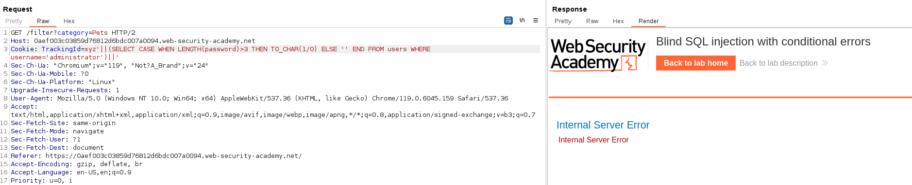
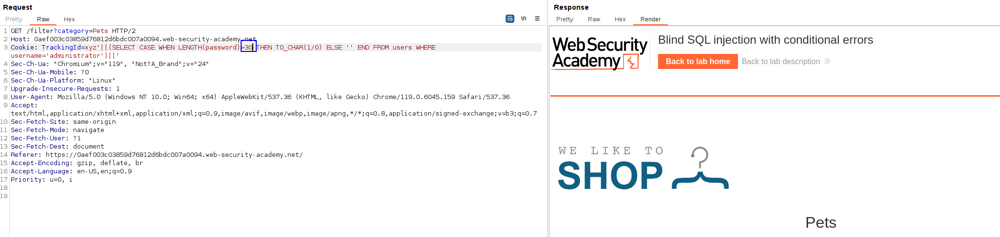
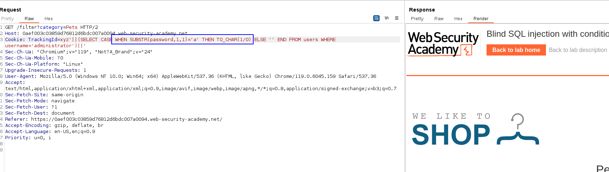
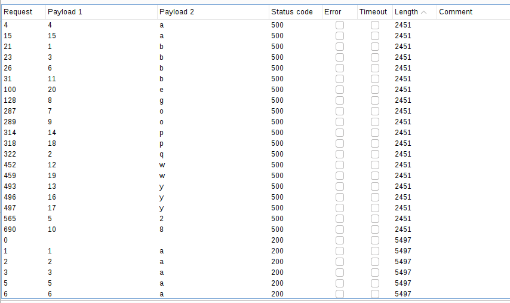
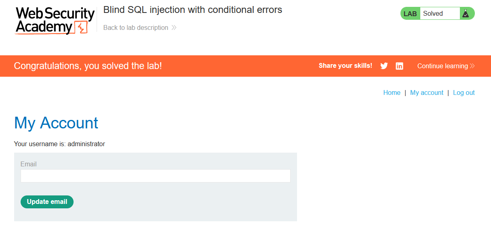

We first have to know the length of the `administrator` password in the `users` table.

For that we can do the following SELECT CASE:
`xyz'||(SELECT CASE WHEN LENGTH(password)>3 THEN TO_CHAR(1/0) ELSE '' END FROM users WHERE username='administrator')||'`

We dont use AND payloads as this database is not MySQL, but oracle (I checked it previously)

This will select a number divided by zero if LENGTH(password) > LEN or an empty string in the other case.

With length=3, the operation is performed, returning a SQL query error:

With 30, the query is not done with errors, so we know it went to the ELSE operator:

With this method, we try numbers until we know it's 20.

Now we do the same with the SUBSTR operator (not SUBSTRING, SUBSTR, as we are in OracleDB).
We do the same operation to verify if each of the positions matches every alphanumeric character:
`xyz'||(SELECT CASE WHEN SUBSTR(password,1,1)='a' THEN TO_CHAR(1/0) ELSE '' END FROM users WHERE username='administrator')||'`

We can see that the first letter is NOT an `a`, as we do not get any error. When we get an error, that is the letter in that position.

Now we just perform a cluster bomb attack to know the character for each position:

Login with this password:
