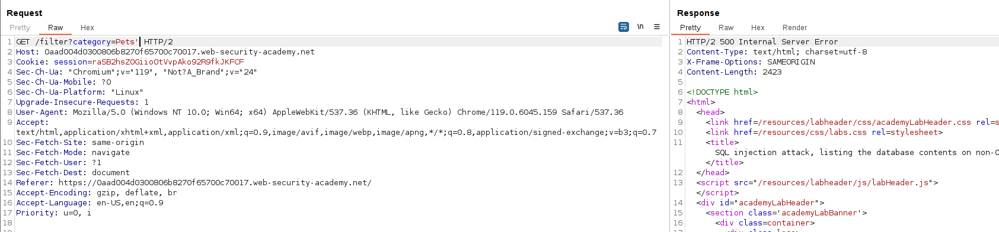
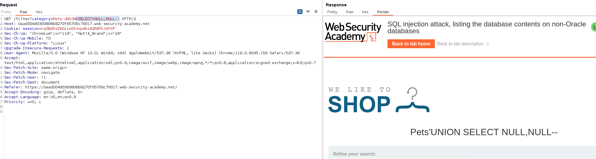
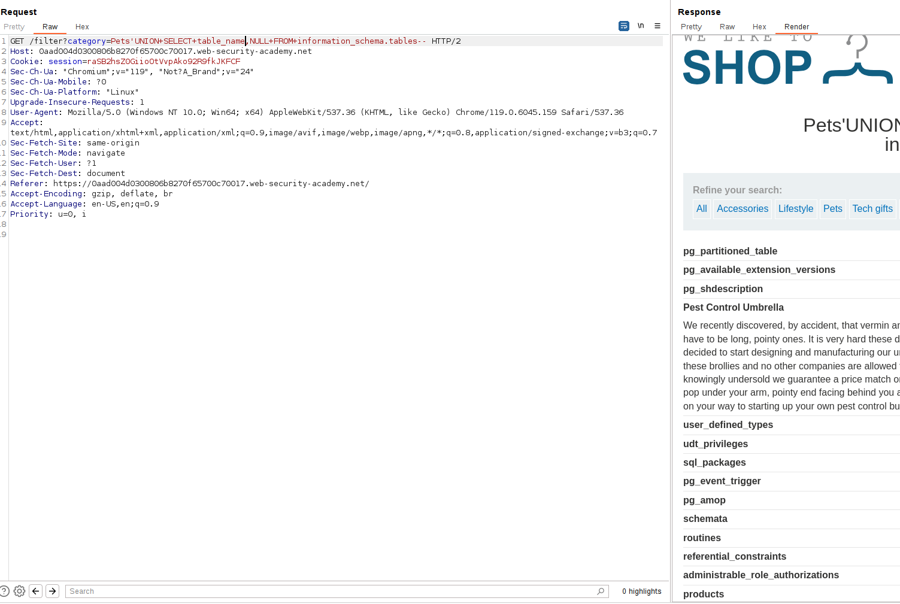
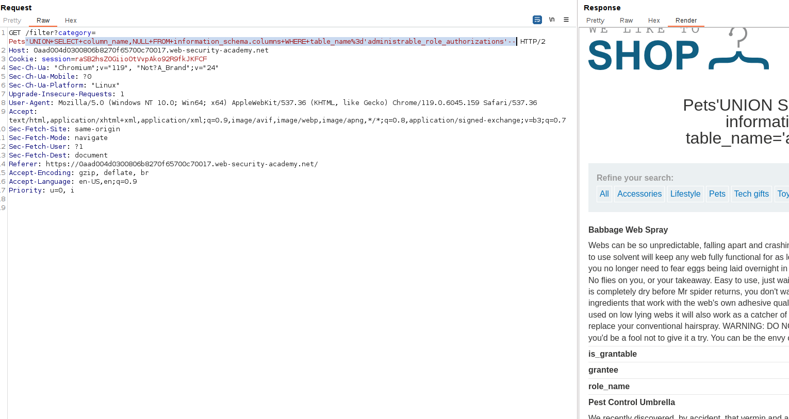
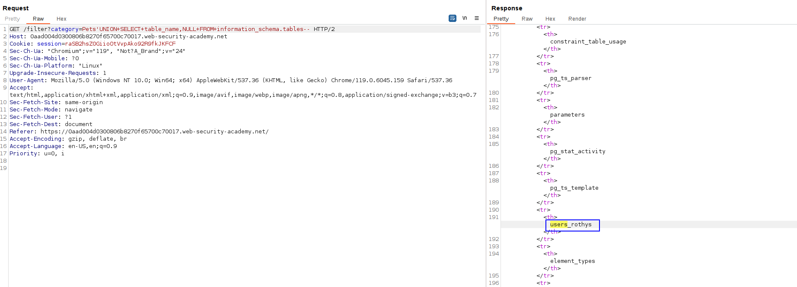
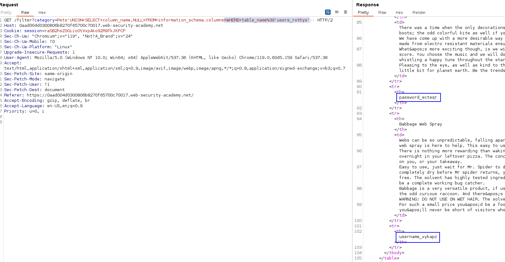
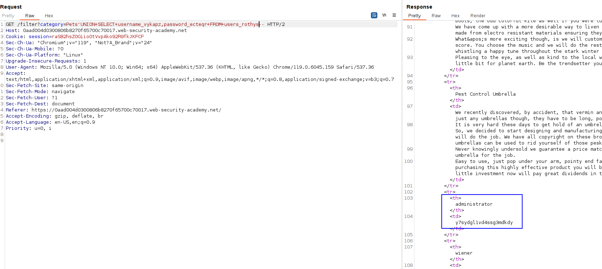
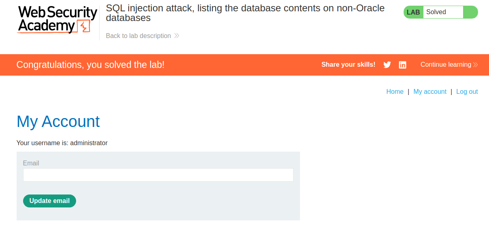

Most database types (except Oracle) have a set of views called the information schema. This provides information about the database.

For example, you can query `information_schema.tables` to list the tables in the database:
`SELECT * FROM information_schema.tables`

We will use this technique.

First, know the number of columns that the injection returns:

With two columns, the query is OK:

We can't select asterisk as the informatiom_schema.tables returns 4 columns. We have to ask for two as maximum.
We are interested in the name of the tables, which is table_name:

We can see interesting tables, let's see the columns of the table administrable_role_authorizations:
`'UNION+SELECT+column_name,NULL+FROM+information_schema.columns+WHERE+table_name%3d'administrable_role_authorizations'--`

But there is not a password field. Let's find in which table the password field is:

This is the database.
Let's get the columns again: 

Now, do the full query as we have the fields and the database name. Just a normal SQL query:

 