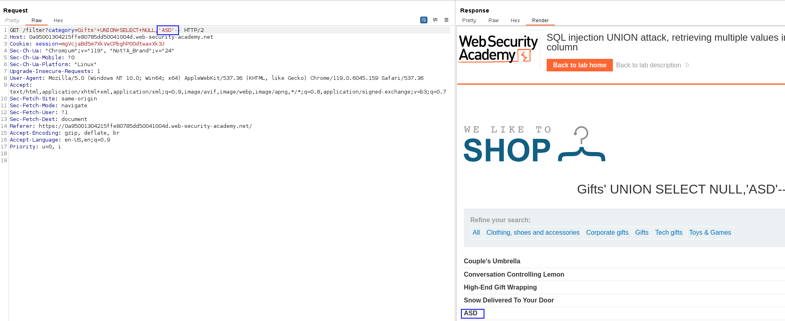
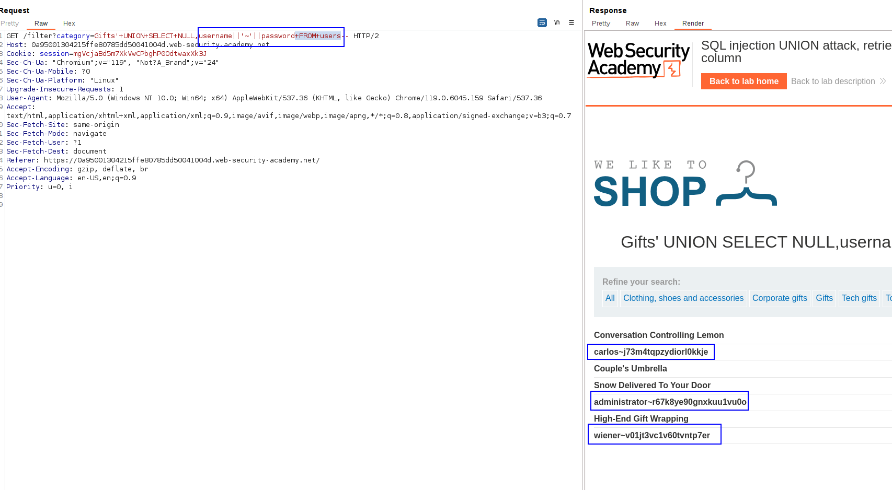

First, we have to retrieve the column that is being displayed. For that, we just use the technique to append a random string on each of the columns and check which string is being reflected.

By testing a bit, we know it's the second column:

Doing this in the first column returns us an error.
So we know the first column must be a NULL. 
In the second column we append `username||'~'||password` to get both columns' information in one column.

We can see that this information is being displayed in the same column.
