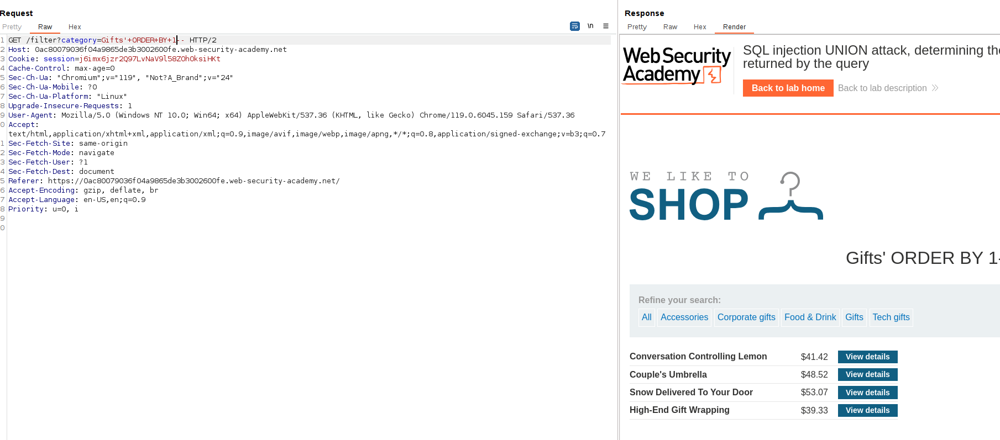

This lab contains a SQL injection vulnerability in the product category filter. The results from the query are returned in the application's response, so you can use a UNION attack to retrieve data from other tables. The first step of such an attack is to determine the number of columns that are being returned by the query. You will then use this technique in subsequent labs to construct the full attack.

To solve the lab, determine the number of columns returned by the query by performing a [SQL injection UNION](https://portswigger.net/web-security/sql-injection/union-attacks) attack that returns an additional row containing null values.

We can see that a SQL query is being probably performed here:

We can filter by element:

That says we can probably ingest something into the SQL query.

If the query is something like:

`SELECT ? from products where category= 'gifts'`

We can try to know the number of columns (marked as ? as we don't know) to then perform an UNION attack with another table, like the users table.

Let's try with the ORDER BY technique first:
ORDER BY 1 works:

ORDER BY 2 works (we can see that the order of the products is being changed, we can also estimate the column just by analyzing the order criteria):

ORDER BY 3 works, but ORDER BY 4 does not work:

Therefore, there is not a 4th column to order, so there are 3 columns.

Let's do the same thing with the NULL technique, which consists in performing an `UNION SELECT NULL, ?` with different NULL sizes.

With null size 1 and 2 we get an error:

But with NULL size 3 we do not get it as **we get the exact quantity of columns with NULL, NULL, NULL**:

We can see that both techniques have to go up from 1 until getting an indicator. In the case of the ORDER BY, we do not get errors until we get one (that is the indicator) and in the case of NULL technique we get errors until we do not get one (that is the indicator).

But both are valid and OK! try both!.