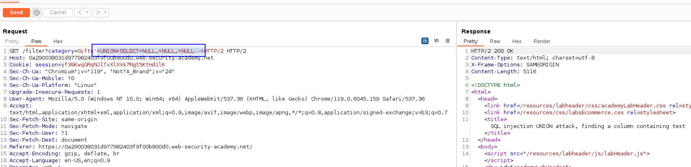
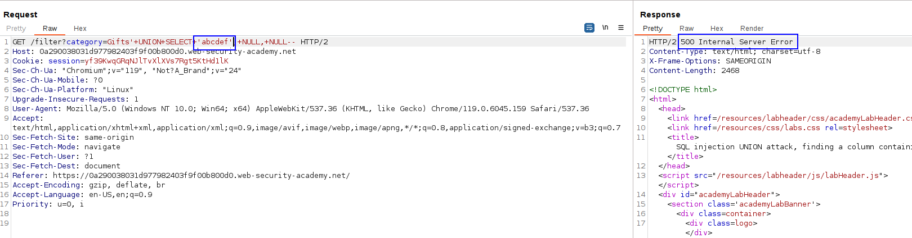
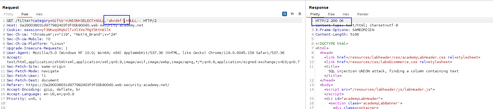
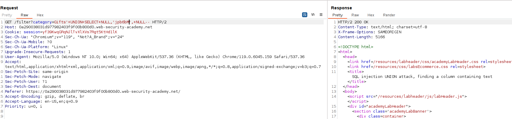

This lab contains a SQL injection vulnerability in the product category filter. The results from the query are returned in the application's response, so you can use a UNION attack to retrieve data from other tables. To construct such an attack, you first need to determine the number of columns returned by the query. You can do this using a technique you learned in a [previous lab](https://portswigger.net/web-security/sql-injection/union-attacks/lab-determine-number-of-columns). The next step is to identify a column that is compatible with string data.

The lab will provide a random value that you need to make appear within the query results. To solve the lab, perform a [SQL injection UNION](https://portswigger.net/web-security/sql-injection/union-attacks) attack that returns an additional row containing the value provided. This technique helps you determine which columns are compatible with string data.

First we must know the number of columns that the database will have.

By using the NULL technique, we know we have 3 columns:

Now, instead adding 3 NULL, we add strings on each column.

Column 1:

Column 2:L

We know the column 2 is a string. W
To solve the lab, we have to return jpb6bM:
