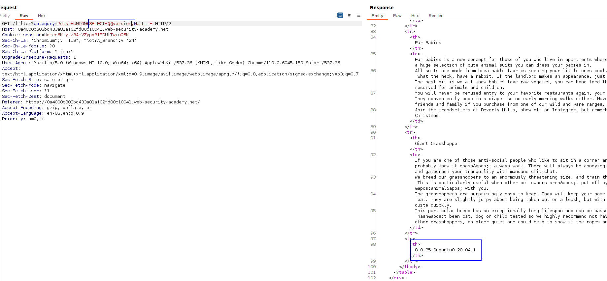

Lab 1: Exfiltrate the version of the database with a basic UNION injection attack.

If we attach a quote onto the category website parameter, we get an error:

What tells us that probably, we have injected code in the SQL query.

The next step is to discover the number of columns, e.g, using the  UNION technique. 

Remember that, on ORACLE databases, we have to add `FROM dual`, or FROM any database, as in ORACLE it is needed to select a database.
The database has two columns:
`'+UNION+SELECT+NULL,NULL+FROM+dual--`

As it is oracle, because we needed to use FROM dual to get the query correctly, just use the proper payload to get the version for ORACLE:

Lab 2: Same thing but with other database engine.
The database has TWO columns, it is MySQL, so we have to either add `#` as the comment or double dash BUT WITH A SPACE AT THE END (`-- `), a double dash with space is not valid. 

Take into account the double space after the dash.
Because of this detail, we know this is MySQL.

