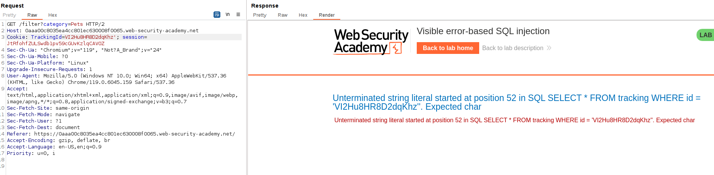
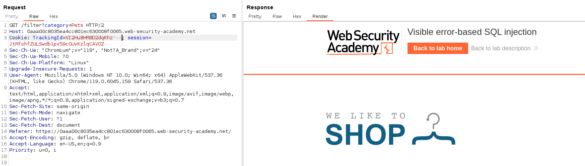
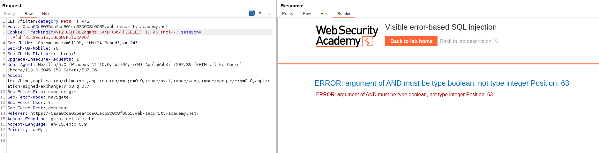
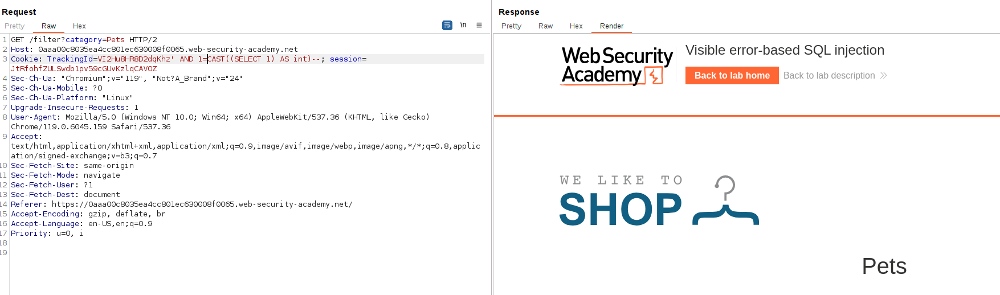
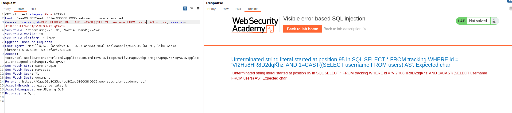
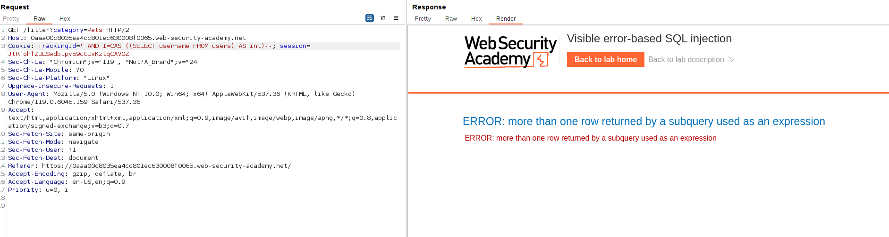
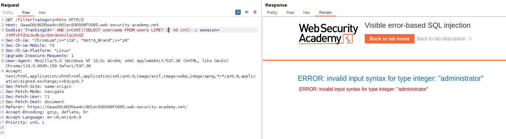
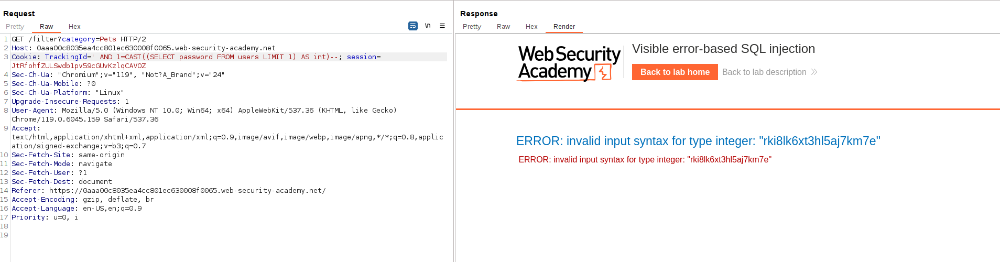
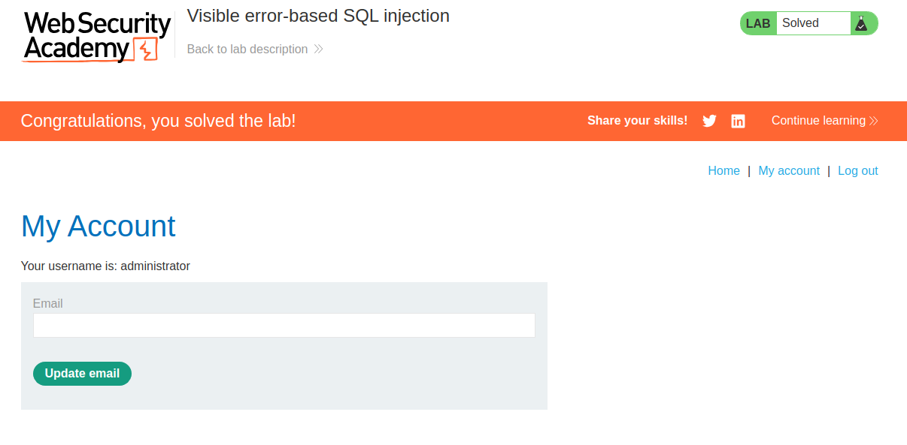

Let's see the error when we perform the SQL injection, adding a single quote on the cookie:

We can see the content of the whole SQL query, which makes it easier to perform the query.
We can see that the error is because an unterminated string literal, so we are going to comment the last part of the query so the query matches:

The query is now sintactically valid.
If we try to add a generic SELECT subquery and cast the returned value to an `int` data type, we can see the error:

If we add an integer variable that takes this value, the error is not shown:

We are going to try to select the username rows from the users table:

We can see in the error that the SQL query is truncated. Time to think, what parts of the query are not important or we can cut down?
We can cut down the `trackingId` part so the query goes deep:

We can now see that there is more than one row returned.
Let's think the ways to return 1 row. We can use the LIMIT operator, that returns an X quantity of rows. With LIMIT 1:

We can see that the first row is the administrator, and it returned the user value. Let's changed the returned value to the password column:

Using this value to log in as the administrator:

