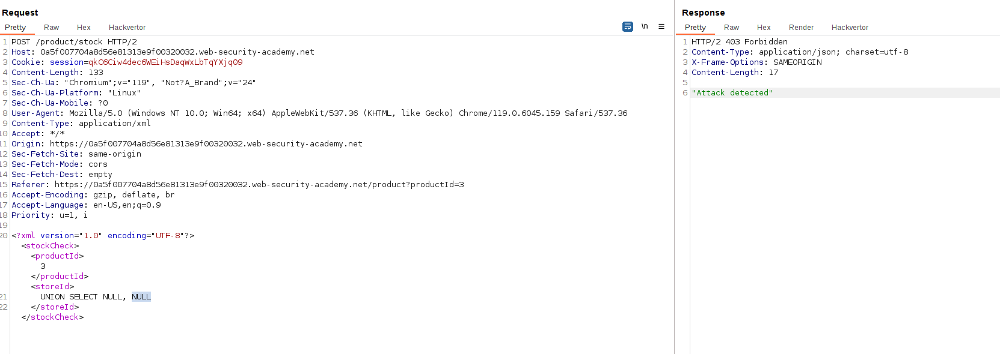
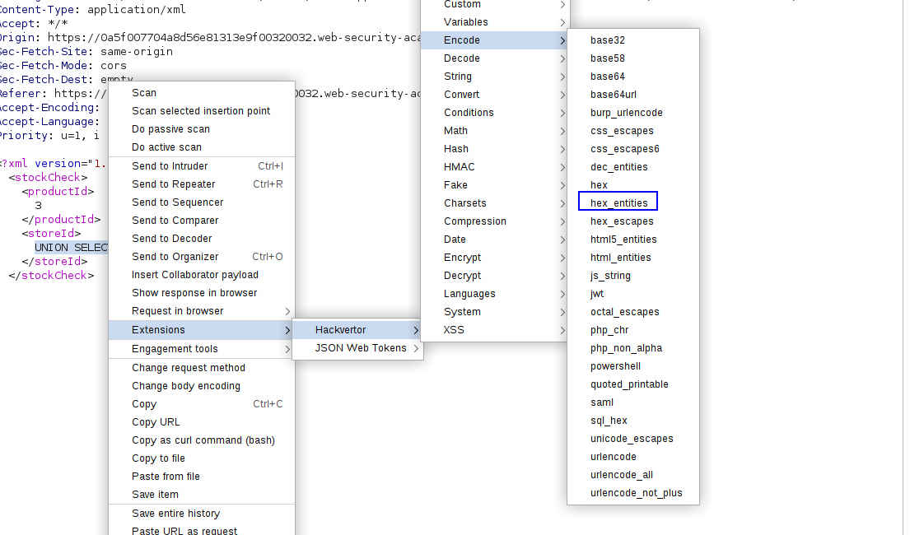
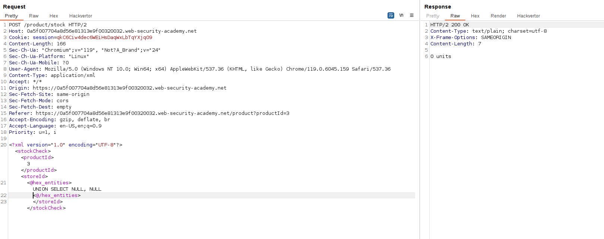
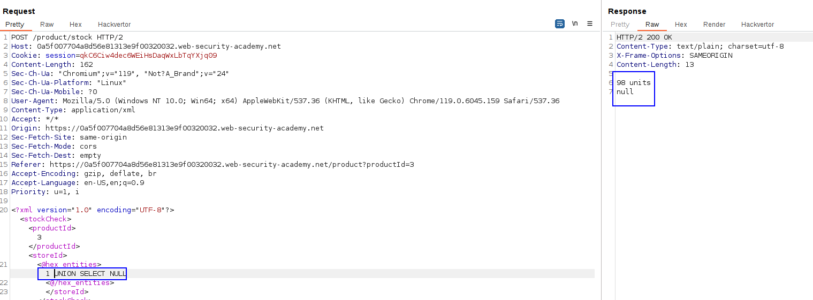
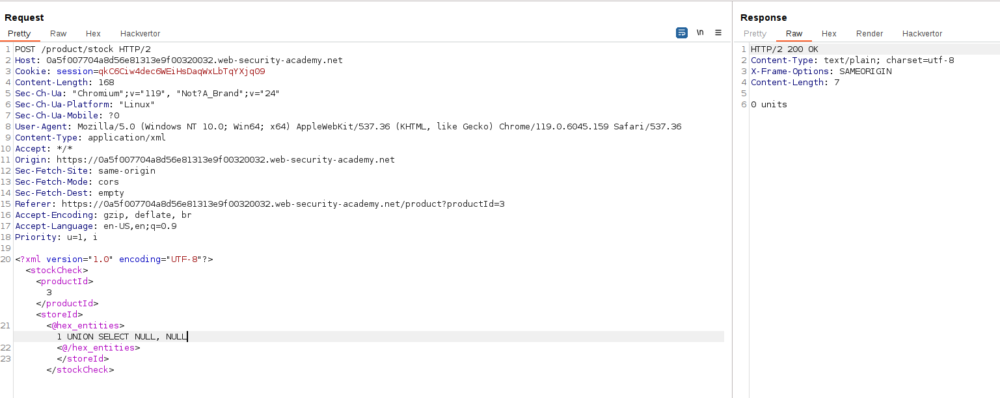
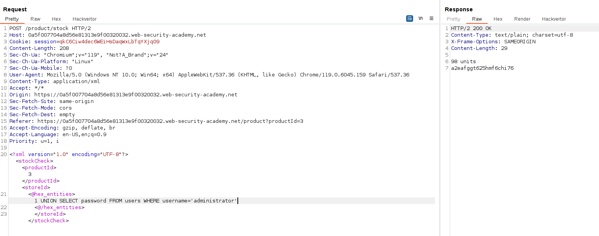
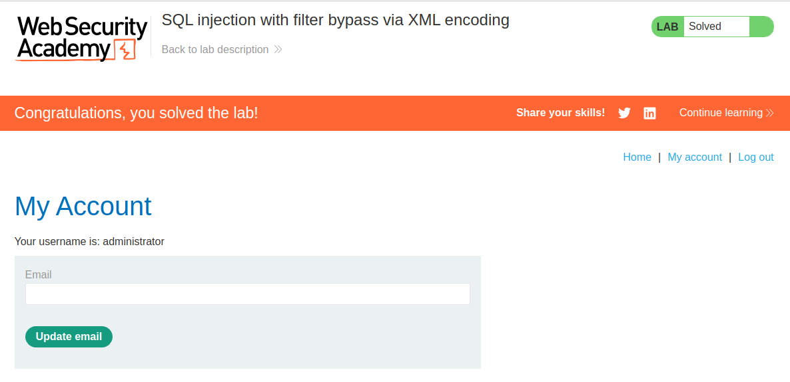

We have the SQL injection in an XML entity. 
Adding an SQL payload in the StoreId throws an attack detection:

We are going to encode the payload using the Hackvertor extension. 
Encoding it with `hex_entities`:

We can see that we have bypassed the SQL injection:

Using the UNION SELECT NULL technique, we can obtain the number of columns:

We can see that it is 1 column, as if we insert 2 NULLs, a 0 is returned:

Taking this into account: we have to extract the password of the administrator user:

