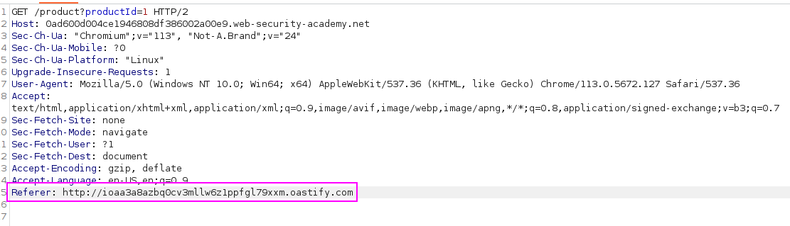
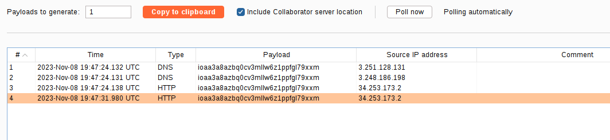

This site uses analytics software which fetches the URL specified in the Referer header when a product page is loaded.

To solve the lab, use this functionality to cause an HTTP request to the public Burp Collaborator server.

We just add the `Referer` header specifying the Burp collaborator server:

We can see the request in Collaborator: 
