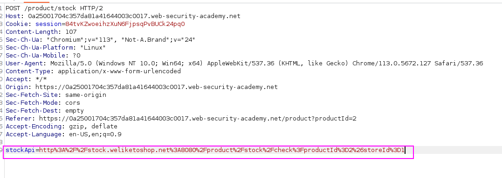
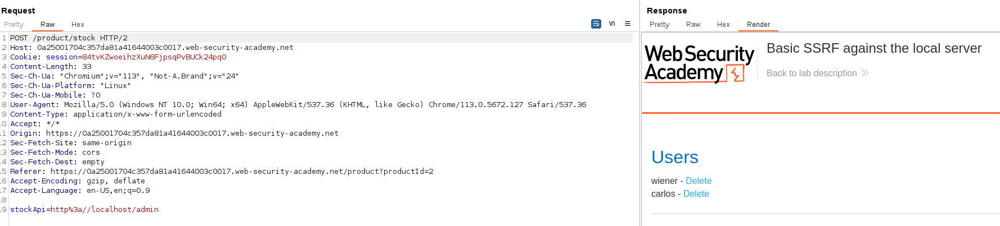
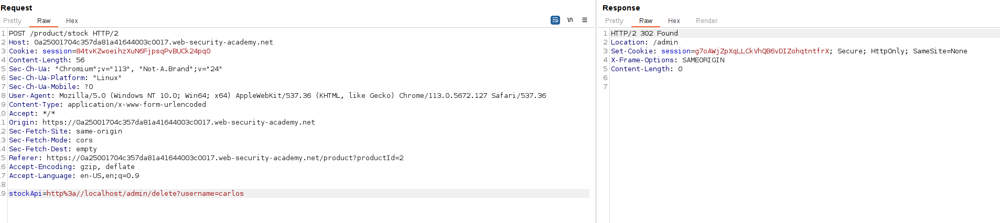

This lab has a stock check feature which fetches data from an internal system.

To solve the lab, change the stock check URL to access the admin interface at `http://localhost/admin` and delete the user `carlos`.

We have to see the request that makes the application send a request:

We can see that it is sending a request to stock.weliketoshop.net, so we are going to change the point where the request is being done to `http://localhost/admin`:

Let's delete the user carlos with the `/admin/delete?username=carlos`:

