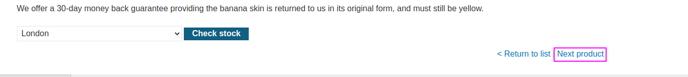
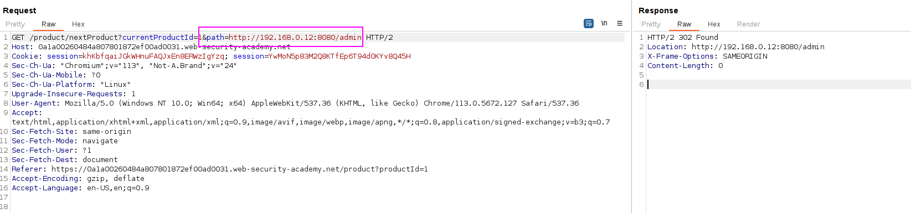
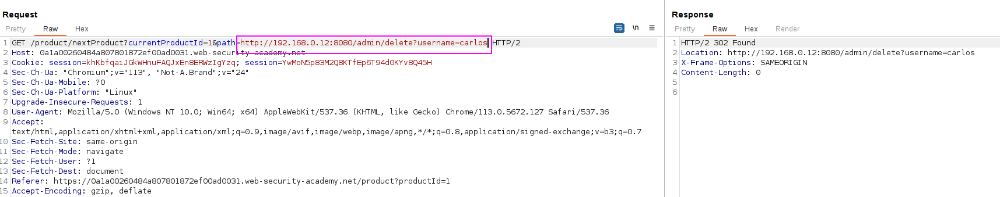
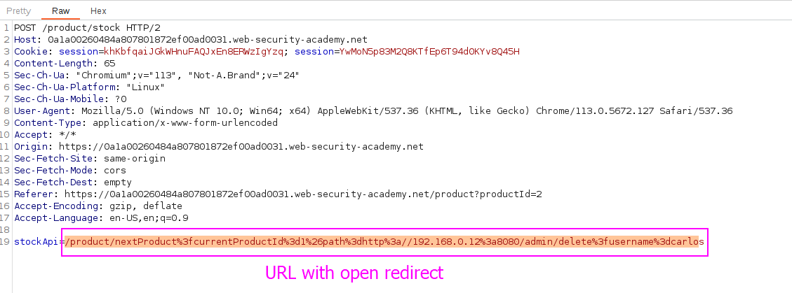
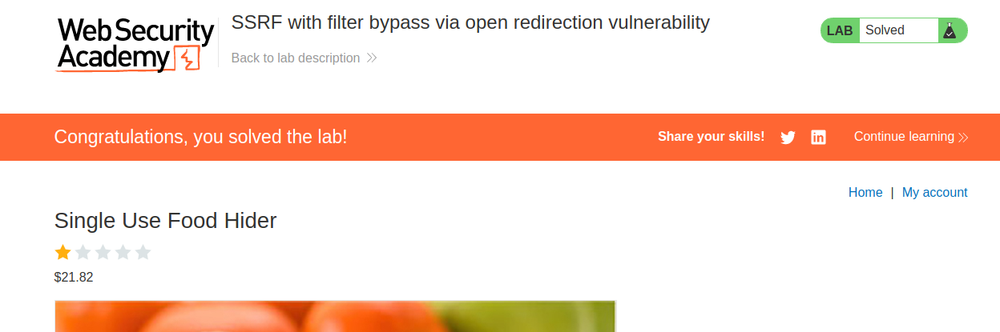

To solve the lab, change the stock check URL to access the admin interface at `http://192.168.0.12:8080/admin` and delete the user `carlos`.

We can't perform SSRF on 

We can see that there is a `next product` option:

That performs a query on the `path` parameter:

We can put an internal URL and we can see we are redirected: 

We are going to add the `/product/nextProduct?currentProductId=1&path=http://192.168.0.12:8080/admin/delete?username=carlos` to the site to perform the request. The backend will perform this request and follow the redirect.

We add the URL to the stockAPI parameter: 
The lab is solved:
