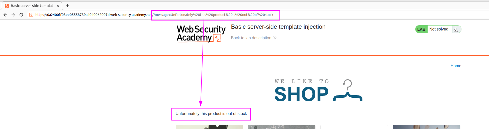
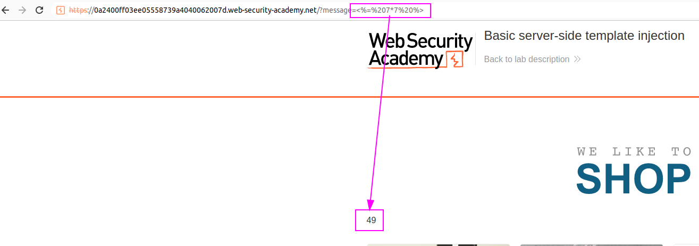
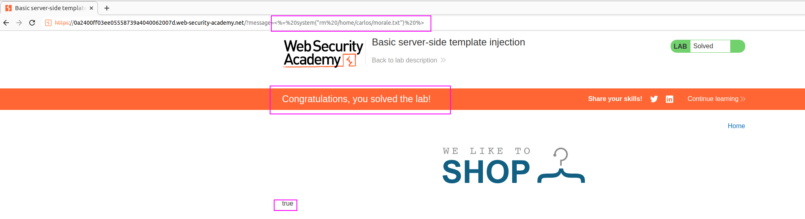

We can see that here the content of the `message` parameter is being displayed:

We can think of XSS, but also SSTI.
Testing some SSTI templates, we discover that it is an ERB templating framework. 
We discovered this by inserting `<%= 7*7 %>` as the template: 

We can see this is rendered.
We can execute code with the following syntax: 
`<%= system("rm /home/carlos/morale.txt") %>`

We learned ERB syntax and also that it is capable of executing commands at OS level.