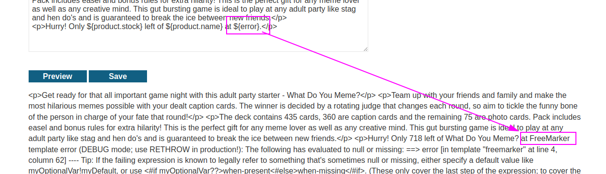
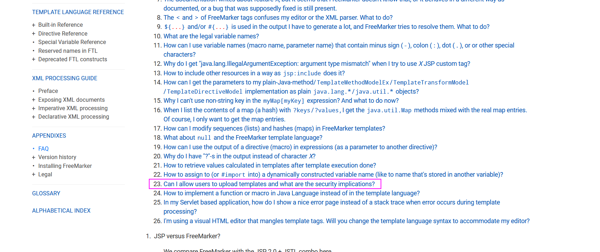
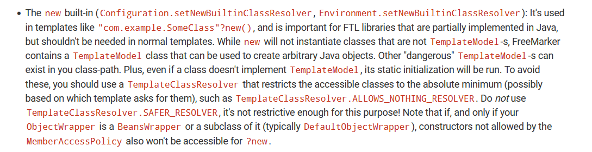
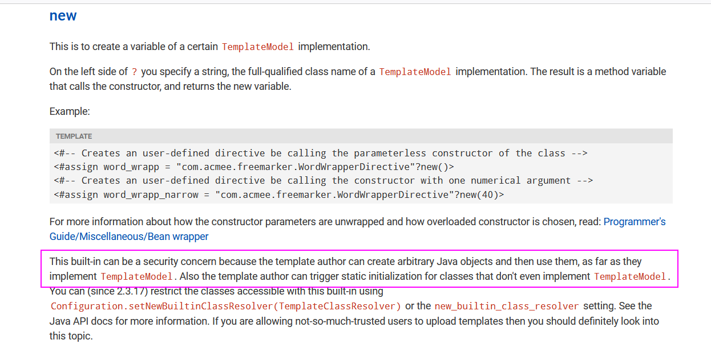
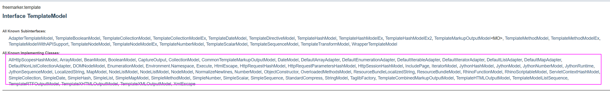
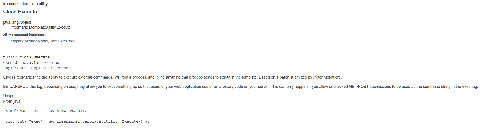
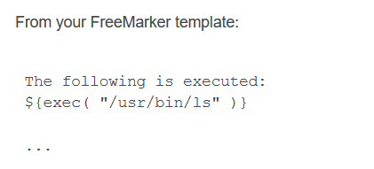
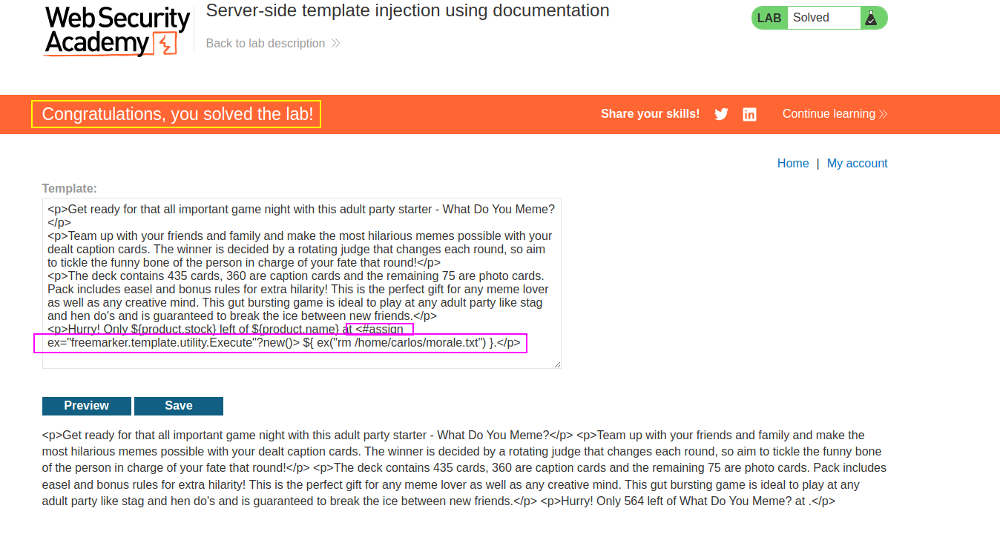

With the account they give, we can see some kind of templating:

We don't know the templating framework, but we can try some things more:

I have learned from this lab that sometimes triggering an error can leads us to the leak of the framework (which is useful information):

Reading the documentation of this framework, we can see the following section:

We can see that the `new()` item is insecure:

It allows creating an arbitrary java object by creating object that implement `TemplateModel`interfaces.

Reading in the `new` documentation, we can see more about its usage and implications:

Reading the documentation of the `TemplateModel` interface, we see which classes do implement this interface:
https://freemarker.apache.org/docs/api/freemarker/template/TemplateModel.html

We must look for a class that allows us executing commands. There is a class called `Execute`:

We must combine the constructor of this method next to the creation of a `new` TemplateModel:
`<#assign ex="freemarker.template.utility.Execute"?new()> ${ ex("rm /home/carlos/morale.txt") }`

This way we use the `new` function, which is the insecure function of the templating, and we call one of the subclasses of the `TemplateModel` class, which is `Execute` and then we just use this variable to execute commands, once the variable is created in the templating framework.

