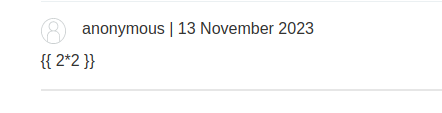

We have the "post comment" functionality:


We are going to try a basic Tornado template:


The template does not get displayed, but we have our user name displayed in the comment:


We can also modify our user name, so it may have the template injection there.
We can choose to display the user name:


And we can try to inject SSTI code here. This will append the SSTI in the code:


We are basically injecting code and we are closing the template and starting a new one.
By creating a new comment we can see we have injected code:

We can try to execute code here with the following structure:
```
{{ os.popen("whoami").read() }}
```


We can see that the `whoami` command displays the user `carlos`:


We are just going to delete the file:
`user.name}}{%25+import+os+%25}{{os.system('rm%20/home/carlos/morale.txt')`


When reading the comment, the command gets executed and we delete the file:
