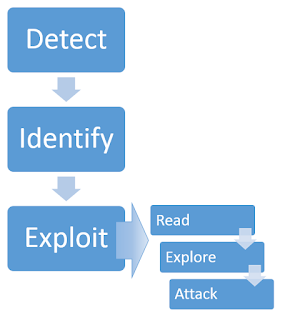

# What is server-side template injection?

Server-side template injection is when an attacker is able to use **native template syntax** to inject a **malicious payload into a template, which is then executed server-side.**

Template engines are designed to generate web pages by combining **fixed templates with volatile data**. Server-side template injection attacks can occur when user input is concatenated directly into a template, rather than passed in as data. This allows attackers to **inject arbitrary template directives in order to manipulate the template engine**, often enabling them to take complete control of the server. As the name suggests, server-side template injection payloads are delivered and **evaluated server-side, potentially making them much more dangerous than a typical client-side template injection.**

Read the best post regarding [SSTI here](https://portswigger.net/research/server-side-template-injection)

# What is the impact of server-side template injection?
Server-side template injection vulnerabilities can expose websites to a variety of attacks depending on the template engine in question and how exactly the application uses it. In certain rare circumstances, these vulnerabilities pose no real security risk. However, most of the time, the impact of server-side template injection **can be catastrophic.**

At the severe end of the scale, an attacker can potentially achieve **remote code execution, taking full control of the back-end server and using it to perform other attacks on internal infrastructure.**

Even in cases where full remote code execution is not possible, an attacker can often still use server-side template injection a**s the basis for numerous other attacks,** potentially gaining read access to sensitive data and arbitrary files on the server.

# How do server-side template injection vulnerabilities arise?
Server-side template injection vulnerabilities arise when user input is concatenated into templates rather than being passed in as data.

Static templates that simply provide placeholders into which dynamic content is rendered are generally not vulnerable to server-side template injection. The classic example is an email that greets each user by their name, such as the following extract from a Twig template:
`$output = $twig->render("Dear {first_name},", array("first_name" => $user.first_name) );`

This is not vulnerable to server-side template injection because the user's first name is merely passed into the template as data.

However, as templates are simply strings, web developers sometimes directly concatenate user input into templates prior to rendering. Let's take a similar example to the one above, but this time, users are able to customize parts of the email before it is sent. For example, they might be able to choose the name that is used:
`$output = $twig->render("Dear " . $_GET['name']);`

In this example, instead of a static value being passed into the template, part of the template itself is being dynamically generated using the `GET` parameter `name`. As template syntax is evaluated server-side, this potentially allows an attacker to place a server-side template injection payload inside the `name` parameter as follows:
`http://vulnerable-website.com/?name={{bad-stuff-here}}`

Vulnerabilities like this are sometimes caused by accident due to poor template design by people unfamiliar with the security implications. Like in the example above, you may see different components, some of which contain user input, concatenated and embedded into a template. In some ways, this is similar to [SQL injection](https://portswigger.net/web-security/sql-injection) vulnerabilities occurring in poorly written prepared statements.

However, sometimes this behavior is actually implemented intentionally. For example, some websites deliberately allow certain privileged users, such as content editors, to edit or submit custom templates by design. This clearly poses a huge security risk if an attacker is able to compromise an account with such privileges.

# Constructing a server-side template injection attack

Identifying server-side template injection vulnerabilities and crafting a successful attack typically involves the following high-level process.

## Detect
Server-side template injection vulnerabilities often go unnoticed not because they are complex but because they are only really apparent to auditors who are explicitly looking for them. If you are able to detect that a vulnerability is present, it can be surprisingly easy to exploit it. This is especially true in unsandboxed environments.

As with any vulnerability, the first step towards exploitation is being able to find it. Perhaps the simplest initial approach is to t**ry fuzzing the template by injecting a sequence of special characters commonly used in template expressions, such as `${{<%[%'"}}%\**`. If an exception is raised, this indicates that the injected template syntax is potentially being interpreted by the server in some way. This is one sign that a vulnerability to server-side template injection may exist.

Server-side template injection vulnerabilities occur in two distinct contexts, each of which requires its own detection method. Regardless of the results of your fuzzing attempts, it is important to also try the following context-specific approaches. If fuzzing was inconclusive, a vulnerability may still reveal itself using one of these approaches. Even if fuzzing did suggest a template injection vulnerability, you still need to identify its context in order to exploit it.

### Plaintext context
Most template languages allow you to freely input content either by using HTML tags directly or by using the template's native syntax, which will be rendered to HTML on the back-end before the HTTP response is sent. For example, in Freemarker, the line `render('Hello ' + username)` would render to something like `Hello Carlos`.

This can sometimes be exploited for [XSS](https://portswigger.net/web-security/cross-site-scripting) and is in fact often mistaken for a simple XSS vulnerability. However, by setting mathematical operations as the value of the parameter, we can test whether this is also a potential entry point for a server-side template injection attack.

For example, consider a template that contains the following vulnerable code:

`render('Hello ' + username)`

During auditing, we might test for server-side template injection by requesting a URL such as:

`http://vulnerable-website.com/?username=${7*7}`

If the resulting output contains `Hello 49`, **this shows that the mathematical operation is being evaluated server-side. This is a good proof of concept for a server-side template injection vulnerability.**

Note that the specific syntax required to successfully evaluate the mathematical operation will vary depending on which template engine is being used. We'll discuss this in more detail in the [Identify](https://portswigger.net/web-security/server-side-template-injection#identify) step.

### Code context
In other cases, the vulnerability is exposed by user input being placed within a template expression, as we saw earlier with our email example. This may take the form of a user-controllable variable name being placed inside a parameter, such as:
`greeting = getQueryParameter('greeting') engine.render("Hello {{"+greeting+"}}", data)`

On the website, the resulting URL would be something like:
`http://vulnerable-website.com/?greeting=data.username`

This would be rendered in the output to `Hello Carlos`, for example.

This context is easily missed during assessment because it doesn't result in obvious XSS and is almost indistinguishable from a simple hashmap lookup. One method of testing for server-side template injection in this context is to first establish that the parameter doesn't contain a direct XSS vulnerability by injecting arbitrary HTML into the value:
`http://vulnerable-website.com/?greeting=data.username<tag>`

In the absence of XSS, this will usually either result in a blank entry in the output (just `Hello` with no username), encoded tags, or an error message. The next step is to try and break out of the statement using common templating syntax and attempt to inject arbitrary HTML after it:
`http://vulnerable-website.com/?greeting=data.username}}<tag>`

If this again results in an error or blank output, you have either used syntax from the wrong templating language or, if no template-style syntax appears to be valid, server-side template injection is not possible. Alternatively, if the output is rendered correctly, along with the arbitrary HTML, this is a key indication that a server-side template injection vulnerability is present:
`Hello Carlos<tag>`

## Identify
Once you have detected the template injection potential, the next step is to identify the template engine.

Although there are a huge number of templating languages, many of them use very similar syntax that is specifically **chosen not to clash with HTML characters**. As a result, it can be relatively simple to create probing payloads to test which template engine is being used.

Simply submitting invalid syntax is often enough because the resulting error message will tell you exactly what the template engine is, and sometimes even which version. 
**For example, the invalid expression `<%=foobar%>` triggers the following response from the Ruby-based ERB engine:**
``(erb):1:in `<main>': undefined local variable or method `foobar' for main:Object (NameError) from /usr/lib/ruby/2.5.0/erb.rb:876:in `eval' from /usr/lib/ruby/2.5.0/erb.rb:876:in `result' from -e:4:in `<main>'``

Otherwise, you'll need to manually test different language-specific payloads and study how they are interpreted by the template engine. Using a process of elimination based on which syntax appears to be valid or invalid, you can narrow down the options quicker than you might think. A common way of doing this is to inject arbitrary mathematical operations using syntax from different template engines. You can then observe whether they are successfully evaluated. To help with this process, you can use a decision tree similar to the following:

You should be aware that the same payload can sometimes return a successful response in more than one template language. For example, the payload `{{7*'7'}}` returns `49` in Twig and `7777777` in Jinja2. **Therefore, it is important not to jump to conclusions based on a single successful response and try with a few payloads to take a conclusion.**

## Exploit steps

### Step 1: Read how does templating works
Unless you already know the template engine inside out, **reading its documentation is usually the first place to start.** While this may not be the most exciting way to spend your time, it is important not to underestimate what a useful source of information the documentation can be.

### Step 2: Learn the basic template syntax
Learning the basic syntax is obviously important, along with key functions and handling of variables. Even something as simple as learning how to embed native code blocks in the template can sometimes quickly lead to an exploit. For example, once you know that the Python-based Mako template engine is being used, achieving remote code execution could be as simple as:
`<% import os x=os.popen('id').read() %> ${x}`

In an unsandboxed environment, achieving remote code execution and using it to read, edit, or delete arbitrary files is similarly as simple in many common template engines.

After detecting that a potential vulnerability exists and successfully identifying the template engine, you can begin trying to find ways of exploiting it.

Here is the first lab that covers exploitation of SSTI: [basic_ssti_erb](labs/basic_ssti_erb.md)
Here is another lab covering SSTI in code context, which is an SSTI caused because our payload gets appended into the logic of the program: [ssti_injection_code_context](labs/ssti_injection_code_context.md)

### Step 3: Read about the security implications
The documentation of the templates can also provide some sort of "Security" section. This section usually warns the user of the templating framework about things that they should avoid doing with the template. This is also invaluable for attackers, as they work as a cheat sheet and give hints about behaviors that we should look during auditing.

Even if there is not a "Security" section, if a particular object or function has a security implication, **there is almost always a warning of some kind in the documentation. This may not be as useful as a "Security" section, but also helps to investigate.**

For example, in the ERB templating framework, the documentation reveals that we can list the directory and read files as follows: 
`<%= Dir.entries('/') %>` 
`<%= File.open('/example/arbitrary-file').read %>``

There is a lab that covers this topic of exploiting flaws because of reading the documentation: [ssti_documentation_help](labs/ssti_documentation_help.md)

### Step 4: Look for known exploits
Another key aspect of exploiting server-side template injection vulnerabilities is being good at finding additional resources online. Once you are able to identify the template engine being used, you should browse the web for any vulnerabilities that others may have already discovered. Due to the widespread use of some of the major template engines, it is sometimes possible to find well-documented exploits that you might be able to tweak to exploit your own target website. 

### Step 5: Explore
At this point, you might have already stumbled across a workable exploit using the documentation. If not, the next step is to explore the environment and try to discover all the objects to which you have access.

Many template engines expose a "self" or "environment" object of some kind, which acts like a namespace containing all objects, methods, and attributes that are supported by the template engine. If such an object exists, you can potentially use it to generate a list of objects that are in scope. For example, in Java-based templating languages, you can sometimes list all variables in the environment using the following injection:
`${T(java.lang.System).getenv()}`

This can form the basis for creating a shortlist of potentially interesting objects and methods to investigate further. Additionally, for [Burp Suite Professional](https://portswigger.net/burp/pro) users, the Intruder provides a built-in wordlist for brute-forcing variable names.

### Developer-supplied objects
It is important to note that websites will contain both built-in objects provided by the template and custom, site-specific objects that have been supplied by the web developer. You should pay particular attention to these non-standard objects because they are especially likely to contain sensitive information or exploitable methods. As these objects can vary between different templates within the same website, be aware that you might need to study an object's behavior in the context of each distinct template before you find a way to exploit it.

While server-side template injection can potentially lead to remote code execution and full takeover of the server, in practice this is not always possible to achieve. However, just because you have ruled out remote code execution, that doesn't necessarily mean there is no potential for a different kind of exploit. You can still leverage server-side template injection vulnerabilities for other high-severity exploits, such as [file path traversal](https://portswigger.net/web-security/file-path-traversal), to gain access to sensitive data.