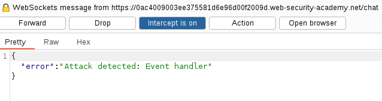
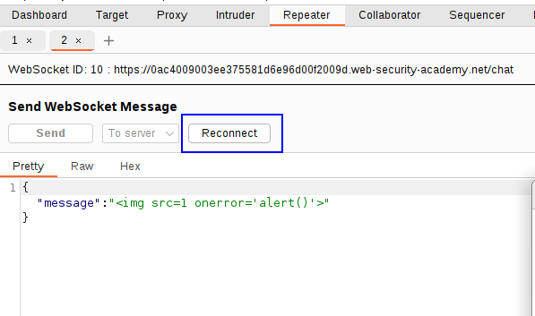
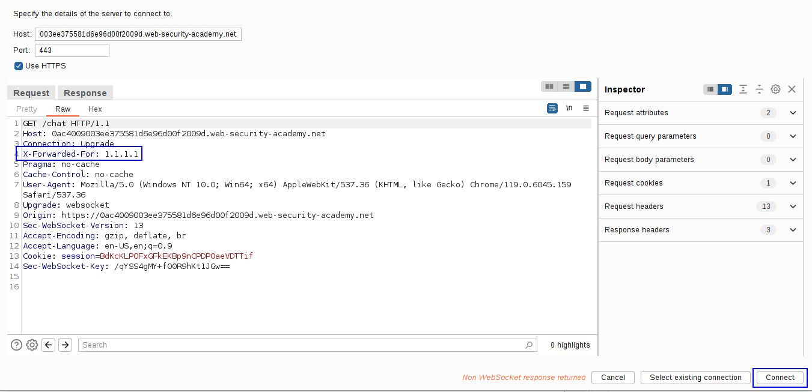
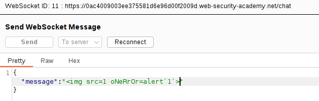
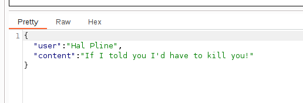

If we now try the XSS payload of before:
``

We can see that the attack has been detected:


And we can't perform more connections as our IP address has been banned.
We have to bypass the IP verification, that most of the time will be performed in the WebSocket handshake.

Going to the Burp Suite repeater and taking one of the previous WebSockets messages:
`X-Forwarded-For: 1.1.1.1`



Now we have bypassed the connection and we can try another payload.
We try an obfuscated payload:
````
Which is just basically adding some uppercase characters. The property is still valid when uppercase, so the script works.


And the response is valid, which means that the script was injected:

