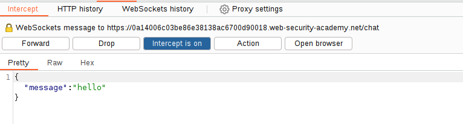
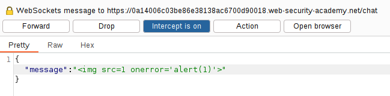

We can see the option of "Live chat". This can be a WebSocket connection as it is a bidirectional flow with an open connection.

Intercepting the message in the live chat leads us to this:

We can replace this by a JavaScript payload, like `alert()`:

We can see that the payload is not rendered:

We can try the `img` payload that can be used to bypass some filters:
``

**We add the payload in the intercepted message as the client HTML encode the message.**
Remember that making a XSS in the browser is not good as we don't control the manipulations that the client will do to our payload.

