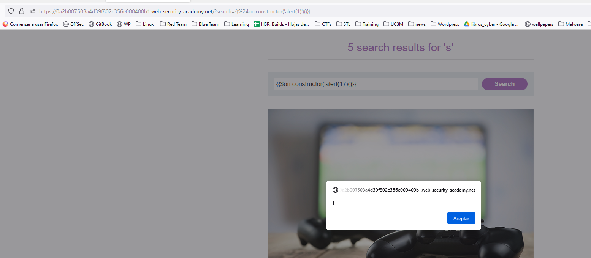

To PWN this AngularJS lab, they have an special payload for AngularJS:
`{{$on.constructor('alert(1)')()}}`

Whatever is inside `ng-app` is being evaluated. In this lab, the whole body of the app is inside `ng-app`:

We can control the parameter of the search, as I introduced an `s`. 
Let's try using the payload that they give us:

Another tip to know if the page uses AngularJS is to look in the Burp Suite scanner:

Or just look inside the source code: 

