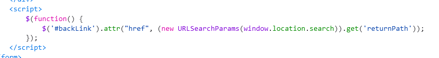
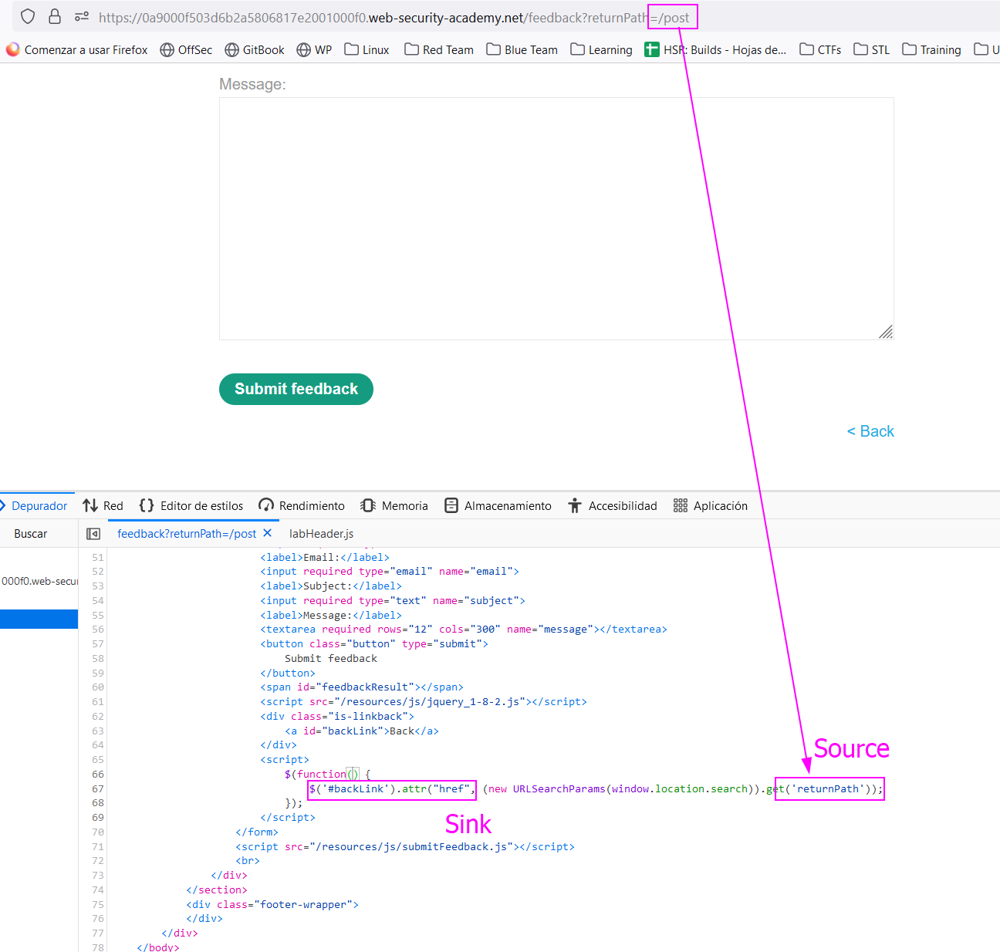
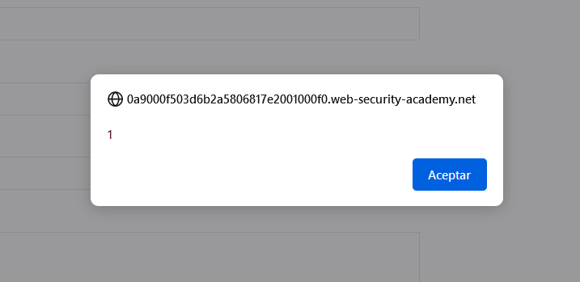

In this case, the jQuery library is the sink. The `attr` function is used to change an attribute `href` on an element of the page, and this is the sink. The attribute value comes from the `URL` which is the source. We have a DOM XSS.

In other words, as Burp Suite says: This lab uses the jQuery library's `$` selector function to find an anchor element, and changes its `href` attribute using data from `location.search`.

The functionality is on the "Feedback" section of the post. We can add feedback to a post. The script includes the following:

This means that the `href` attribute to `backlink` changes to the `returnPath` parameter in the URL:

Here, I tried to add "classic" and previous JavaScript payloads and they didn't work. The payload is needed to start with `javascript:`, so something like this works:
`javascript:alert(1)`

Adding this payload triggers the XSS:

We can see the `href` attribute of the element chosen has been changed to our XSS payload. If we click the element, the script pops up:
