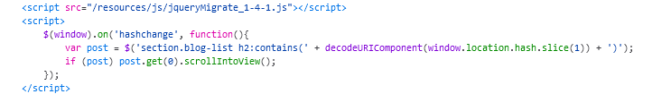

DOM XSS in jQuery selector sink using a hashchange event.

The vulnerable piece of code is:

Está leyendo el `location.hash` y está intentando autoscrollear a esa sección. Por ejemplo, si ponemos `open`, está cogiendo la primera entrada que encuentra que empiece así y nos autoscrollea a ella.

Nos dice lo mismo el scanner de BurpSuite: 

El cómo explotarlo es más complicado sin mirar la solución, y sinceramente he mirado el payload que me da BurpSuite:

Efectivamente:

Entiendo que hay que posicionar ahí el payload, pero no entiendo porque hay que cerrar con `'=>` al principio. **De hecho, lo he analizado y sólo hace falta poner '**, una sola comilla, para cerrarlo y funciona.

