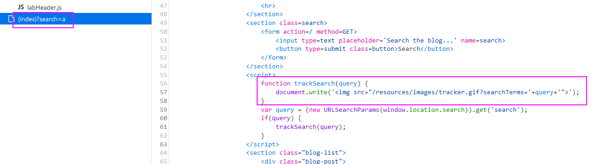
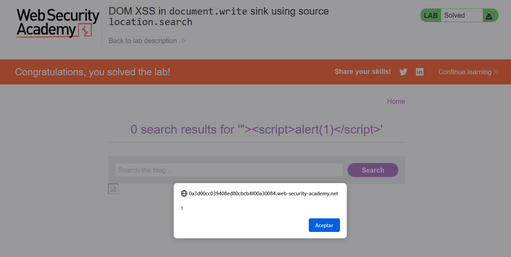

DOM XSS with `location.search` as the sink, and loads the payload on `document.write`:

We can see that there is a `document.write` that is not sanitizing the code.
Let's craft an XSS payload to close the `img src`, which for that we only need to close the variable referenced by `src` the `` and then add our payload:
`">`

Note that they use another payload instead of `script`, and this may be because `script` might not work. They use an `svg` payload: `"><svg onload=alert(1)>`

