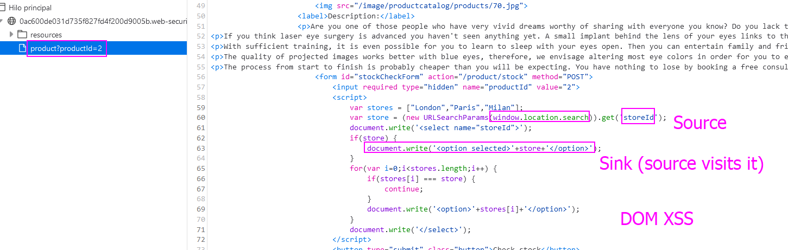
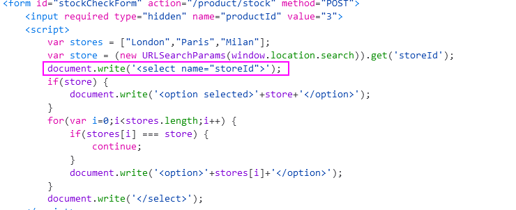
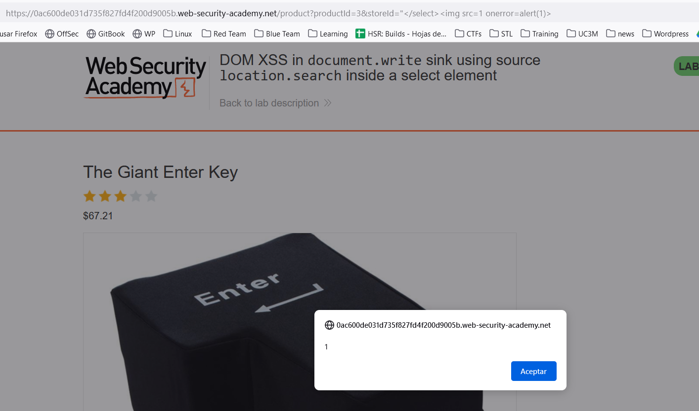

DOM XSS with `location.search` as the sink, and loads the payload on `document.write` **with the modification that the data is enclosed within a select element.**
We need to break out of the `select` element and call the `alert` function.

Let's see the victim script that is vulnerable:

We can see clearly the DOM XSS as the source visits the sink.
The problem is that the option is inside an `<option selected>` declaration. We might need to add that to our payload:
``</option>``
But this does not work **as there is another document.write with another `select` on the Store ID before that we also need to close:**

We have to close that select, so we append `"</select>` at the start of the script to close it.
The final payload would be: ``"</select>.
In the URL we can append the StoreID parameter, so we have control of the source:

Note that in the demo I saw after making this lab, another possible payload is:
`</option></select>`.
Also I tested and this also works, changing the closement of `option` and `select`:
`</select></option>`.

