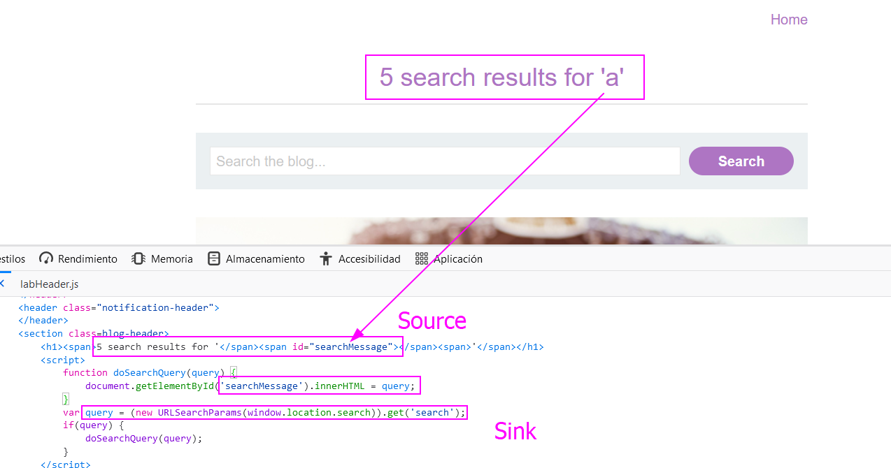

As we have commented previously, `innerHTML` does not accept `script` nor `div` payloads. We will use `img` and `iframe` payloads.

Let's see the vulnerable JavaScript code:

We can just append our payload, that will be stored in the `searchMessage` variable and  then passed into `query` (note that there is a sink called `innerHTML`, so we have to create an `img` payload with a handler like `onerror`. That is easy: ``. The image won't load, we will get an error, and on the error we have a JavaScript handler.

