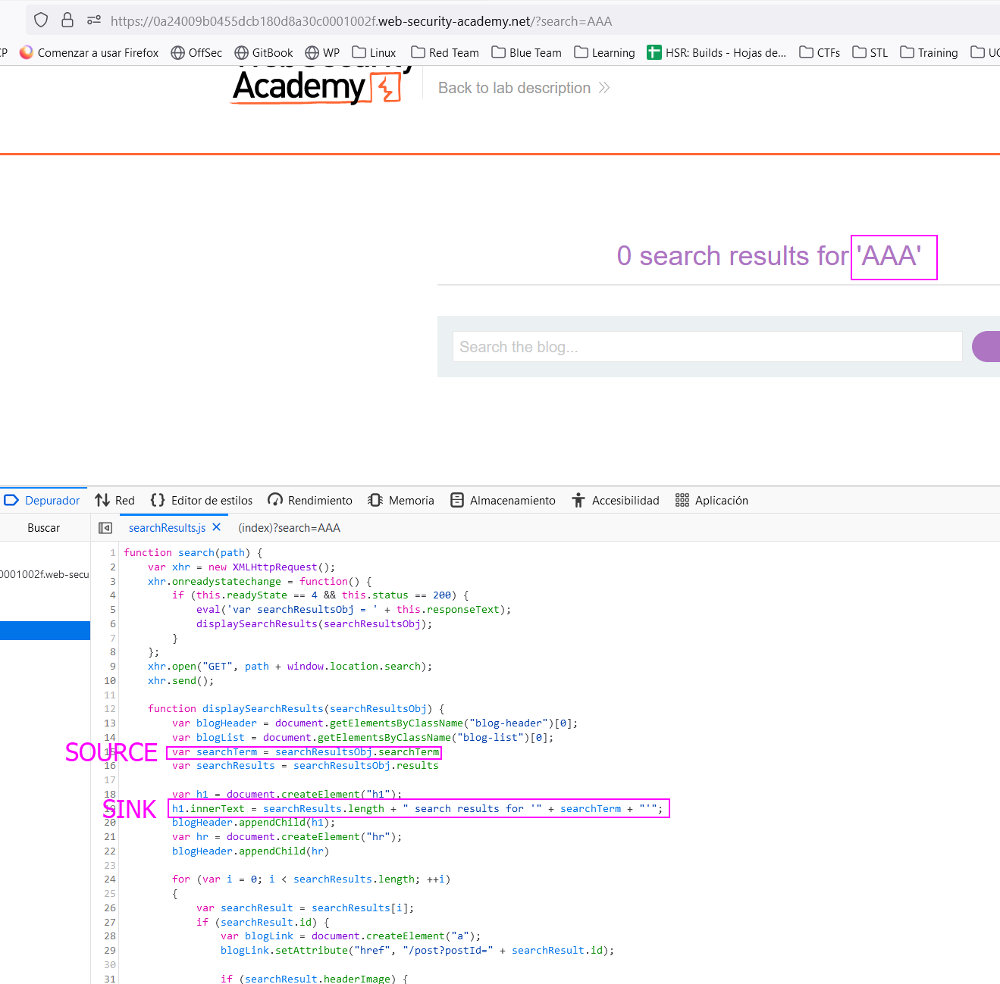
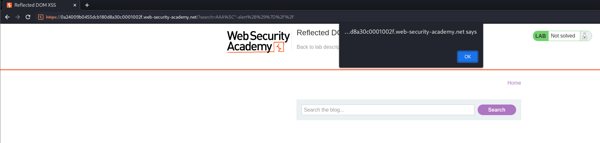

This lab is a DOM XSS where the source is contained in the response that the website gives us, acting like a reflected XSS but is a DOM XSS as well.

In the script we can see that the searchID parameter is not the source, but the searchTerm, that is extracted from the response of the webpage. Investigating why that variable is called searchTerm and how it is created, I see that one of the responses of the server contains it:

I sent this request to the repeater and crafted my XSS payload, but none of the previous payloads worked. This is because the approach to execute code is different. **The sink is not what I expected, but an `eval()`** function that happens before:

Here, the response text is the source and the  `eval` function is the sink. What we have to do is to append a `alert()` code in this eval function.
For that, we have to manipulate the JSON creation, so `alert` is added in the JSON.
If we try to add the script by substracting it in the variable (`eval` will still execute it), we can see that a backslash is being added into the payload to escape our character. To avoid this, we will add another backslash to **scape the backslash that is being generated, and creating a 0 effect backslash.**

Now we can see that our payload is being added in the JSON but the JSON is malformed as the end of the JSON does include an extra quote. let's comment that part of the JSON and ending our own closing character:

The final payload is the following: `AAA\"-alert()}//`.
The first backslash is to escape the backslash that the page includes next to our quotes, to anulate the effect of it. The first double quotes are to close the AAA text properly, and then we append `-script()` to be added into the variable that is going to be evaluated with `eval`. Next, the `}` character closes the JSON properly and the `//` characters are to comment the following characters so they are not rendered and the JSON is properly crafted. Having this into account, attachign the payload as the search term causes the variable to load `AAA - script()` into an `eval` function, getting our XSS:
