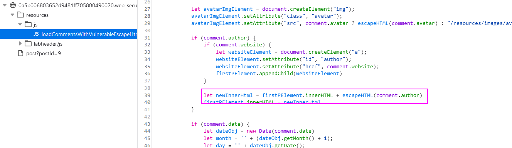
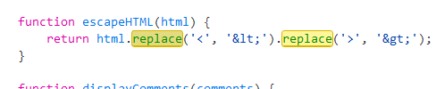
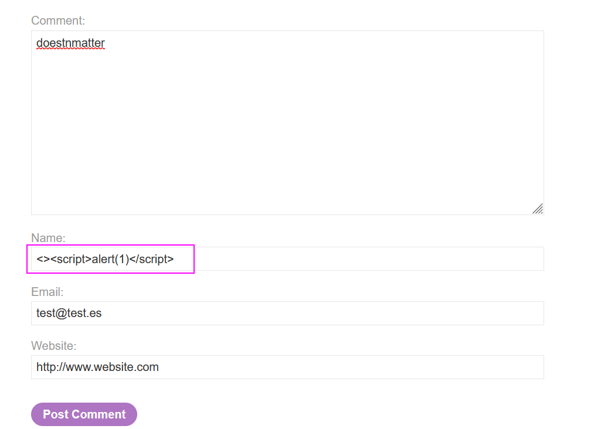
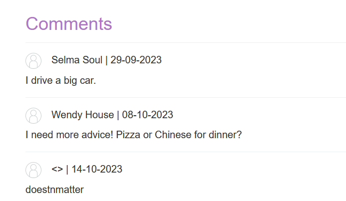
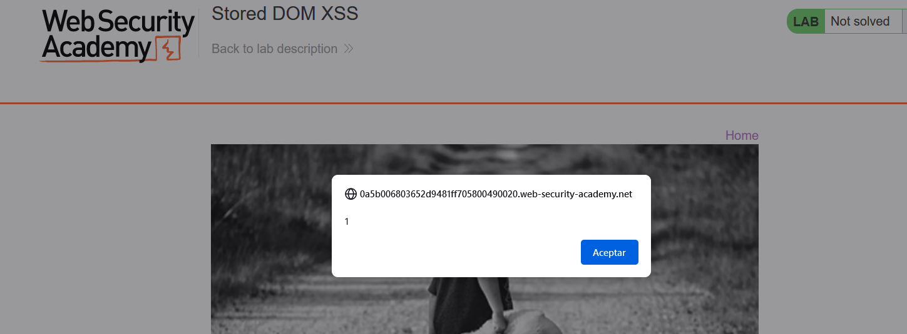

Stored DOM XSS.
Let's find the piece of code that is vulnerable and tells us that there is an stored DOM XSS:

Here we have the `innerHTML` sink that has `comment.author` within a `escapeHTML` function. 
This function does the following:

BUT, **this function does not replace all the occurrences as the `replace` function does not replace ALL THE OCURRENCES BUT THE FIRST ONES, so we can add an extra > and < into our payload at first, and then our payload.**
Let's create the payload (remember, the author is the vulnerable field):

But this payload does not work:

Trying with the recommended payload (`<>`) using the same bypass technique gives us an XSS:

Remember to use `img` and `iframe` payloads instead of `script`.

