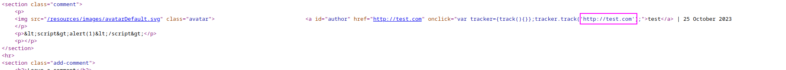
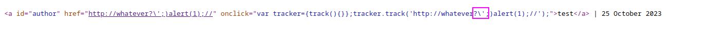
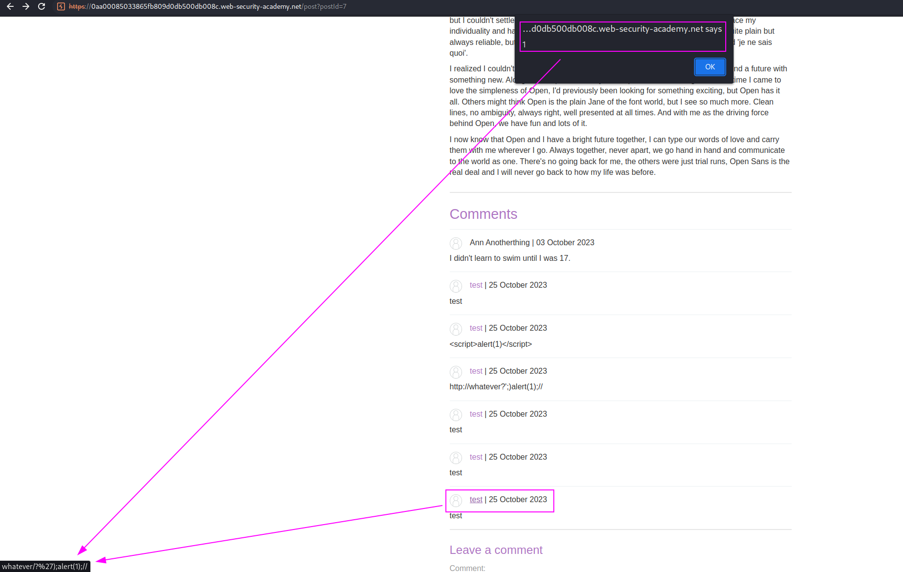
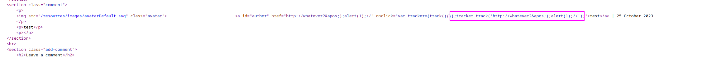

We are going to use HTML encoding to bypass a filter that blocks or escape single quote characters.

The vulnerable site is here, on the website we can add as comment attribute:

If we try to append a website with a payload, like `http://whatever?';);alert(1);//`, trying to scape the website and comment the rest, does not work as our quotes are being scaped:

We can try to HTML-encode it, passing from `'` to `&apos`, so our payload would be: `http://whatever?&apos;);alert(1);//`

This way we get our stored XSS just by HTML encoding one character:

This is the source code, where we can see that the code is not being scaped as we HTML encoded the single quote:
