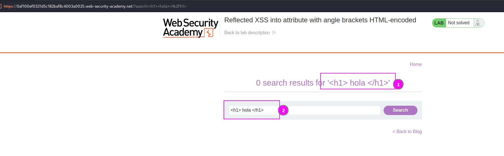
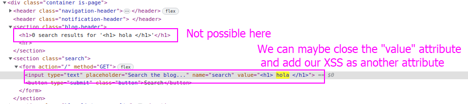
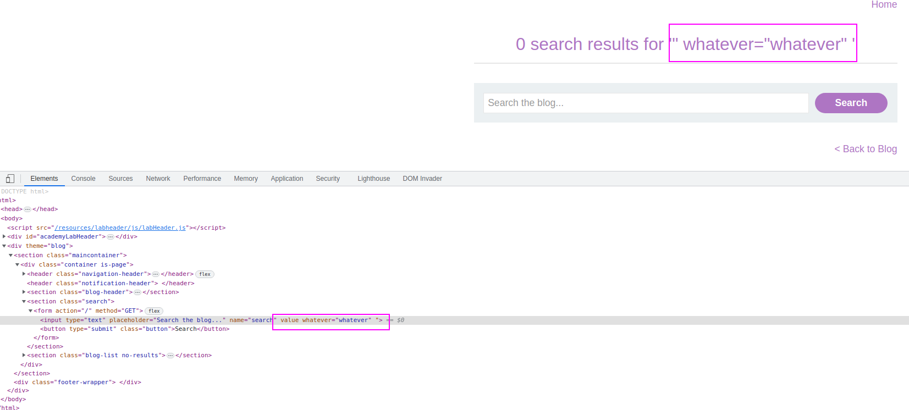
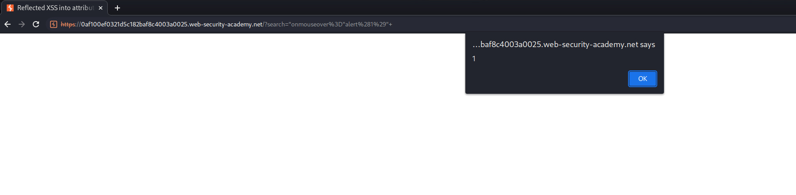

This lab shows us that there can be more than one site where our payload is being rendered.

When we insert a XSS payload, it gets shown in two places:

Indeed, we can close the attribute by adding `"` and adding whatever else:

There is an attribute called `onmouseover` that executes whatever we add if we hover the mouse inside it. Adding the payload `"onmousemove="alert(1)"` , the first quotes to close the attribute and then adding our malicious attribute, makes our text execute XSS if we hover over it:

