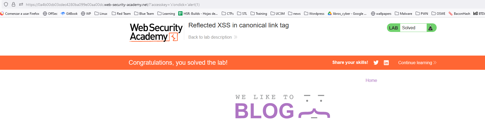

To assist with your exploit, you can assume that the simulated user will press the following key combinations:
- `ALT+SHIFT+X`
- `CTRL+ALT+X`
- `Alt+X`

This concept is abusing the `accesskey` attribute. 

This lab is very specific as we are including the XSS on a canonical link tag and the user has to press a specific combination of buttons to trigger the XSS.
We can see that the user is pressing `X` in all cases, so we will do a XSS payload that works for the three interactions, on a `X` button press:
``https://YOUR-LAB-ID.web-security-academy.net/?%27accesskey=%27x%27onclick=%27alert(1)``

