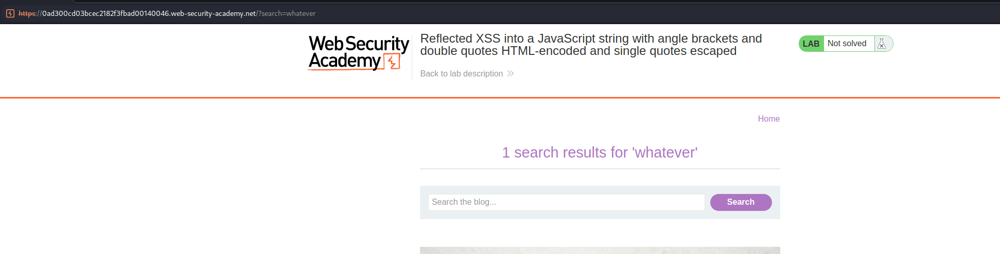
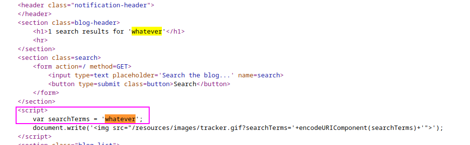
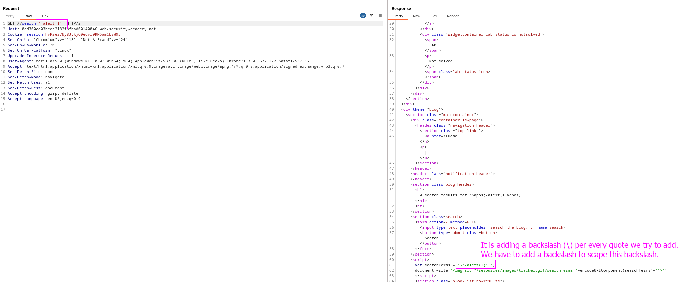
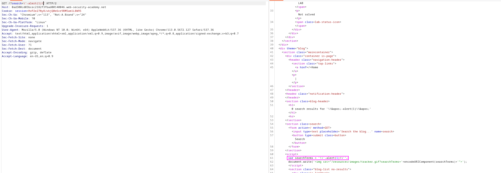
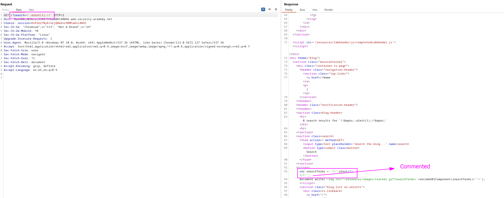
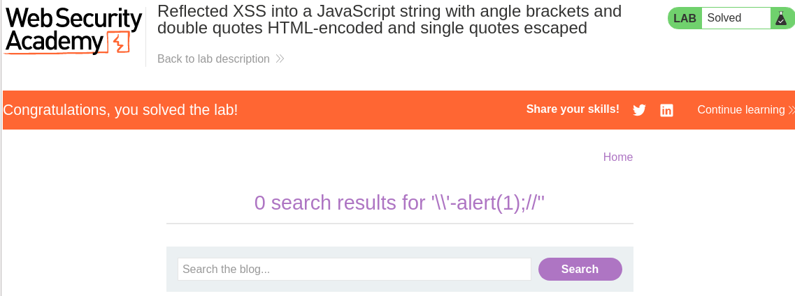

This lab contains a [reflected cross-site scripting](https://portswigger.net/web-security/cross-site-scripting/reflected) vulnerability in the search query tracking functionality where angle brackets and double are HTML encoded and single quotes are escaped.

To solve this lab, perform a cross-site scripting attack that breaks out of the JavaScript string and calls the `alert` function.

Let's see the vulnerable part of the page:

We can see that our code is being displayed on the page. Viewing the source code:

We can try to add the following payload, from other laboratory, to execute a javascript inside the same variable:

We can see that a backslash is being added to every quote to scape this quote and not treat it as a special character. **We have to intentionally add a backslash next to each quote so our backslash treats the backslash that is being added as a non-special character, bypassing this defense mechanism.**

Touching a bit the payload leads us to commenting the last part and adding a ; intentionally:

This is the final payload: `/?search=\'-alert(1);//'`

