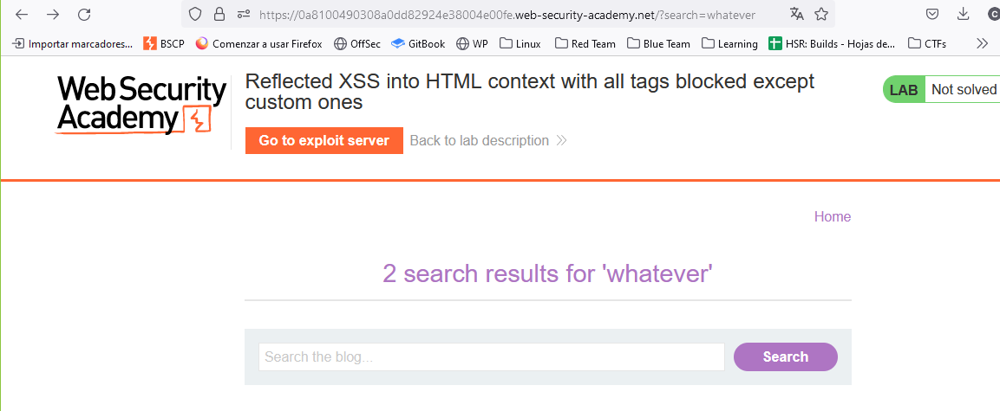
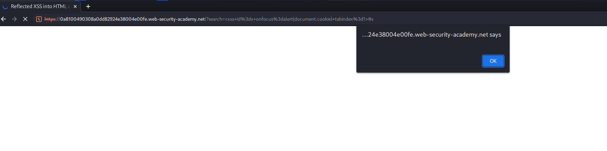
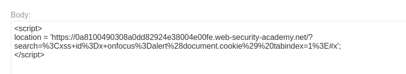

This lab gives us a hint that all tags are blocked but one.
First, let's find the vulnerable XSS place.



Seems that this is the place where we can inject our code.
Now we have to create a custom XSS tag, as they are not blocked.

Searching in internet, I saw a popular tag example with the `onfocus` attribute. Note that we need to end the URL with `#` to make the page focus on that object and execute the code:
`<xss+id%3dx+onfocus%3dalert(document.cookie)+tabindex%3d1>#x`

We are creating a custom tag with the name `xss` and giving it a variable name called `x`, with the `onfocus` attribute we execute code.

Then, we have to store it on our exploit server. Previous techniques showed us that it could be done with `iframe`, but this time is loading a `script`tag:
```
<script>
location = 'https://0a8100490308a0dd82924e38004e00fe.web-security-academy.net/?search=%3Cxss+id%3Dx+onfocus%3Dalert%28document.cookie%29%20tabindex=1%3E#x';
</script>
```
