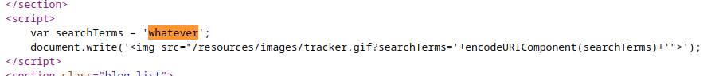
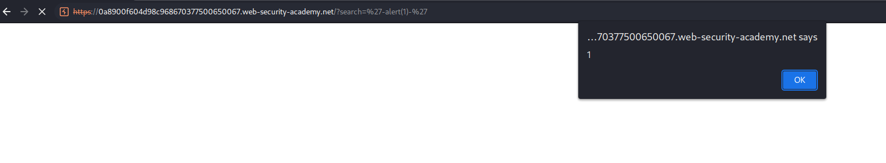
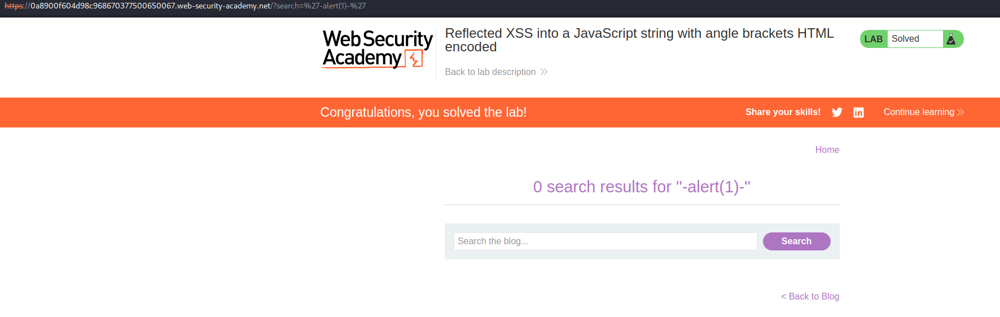
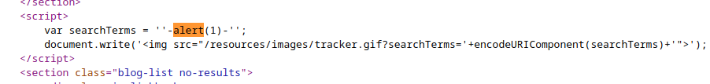

This is the vulnerable code:

We can try to break this variable and execute code inside the `script` tag that is already created. Example payloads are:
`-alert(document.domain)-`

We have to scape the variable, which is inside quotas, so we need to add a quota before , and another after that, to be correctly closed. The payload would be:
`'-alert(1)-'

This is the code with the payload:

We are basically creating a variable with quotas and then substracting our script, so the script must be rendered for the variable to be created.

