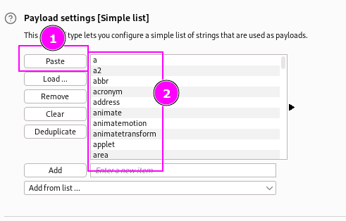

This lab is a Reflected XSS lab with a WAF to protect against comon XSS vectors.
In order to solve this lab, you have to find a suitable payload.

I tried with this initial payload:

But the WAF was preventing the execution:

The idea is to test for another tags. For this, the [XSS cheat sheet](https://portswigger.net/web-security/cross-site-scripting/cheat-sheet) is amazing to extract all tags:

Pasting this tag in the intercepted request:

We paste the copied tags:

Now, Burp Suite will try with this payloads: `<aa>, <a2a2>`, etc...
Let's see which gives us a 200 OK response: that means that the WAF is bypassed:

We can see that `body` has been bypassed.

Doing the same technique but **using the full XSS payload table (this means not the tag, but the whole content)** gives us some results:

Trying this successful payload, `<body onresize="print()">`, gives us XSS, but this lab is not about executing the script **locally but sending it to a victim, like an exam. For this, we have the EXPLOIT SERVER:**

We are going to create an `iframe` with our script embedded in it:

This way, the victim that will visit `/exploit` will render the iframe and execute the payload. The payload is URL encoded, for it to work.
Payload: `<iframe src=https://0ad100670406378a83d8fbeb00070067.web-security-academy.net/?search=%22%3E%3Cbody%20onresize=print()%3E"onload=this.style.width='100px'>`
This gets us the lab:

