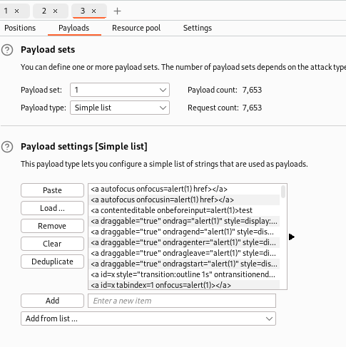

This lab has a simple [reflected XSS](https://portswigger.net/web-security/cross-site-scripting/reflected) vulnerability. The site is blocking common tags but misses some SVG tags and events.
To solve the lab, perform a [cross-site scripting](https://portswigger.net/web-security/cross-site-scripting) attack that calls the `alert()` function.

For this, we will:
1. Find the vulnerable reflected XSS section
2. Fuzz with a lot of payloads

This is the vulnerable XSS section:

We now have to fuzz with a lot of payloads, taking the payloads with the [XSS cheat sheet](https://portswigger.net/web-security/cross-site-scripting/cheat-sheet)

Putting our list of payloads:

This is very slow, so I first detect which HTML tag is the one allowed:

`animatetransform` is allowed:

We copy all the payloads that have this tag:

I tried with the first payload of this type:

And it worked, we got XSS:

