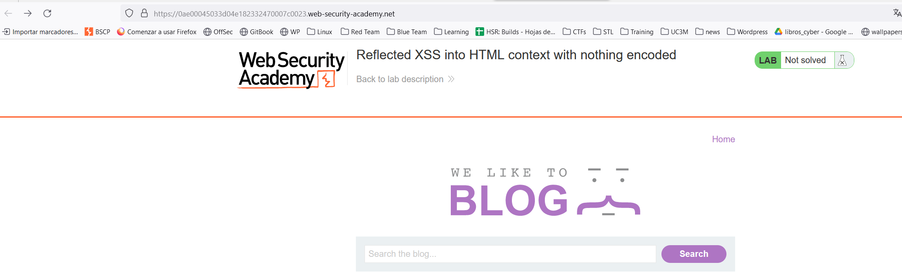
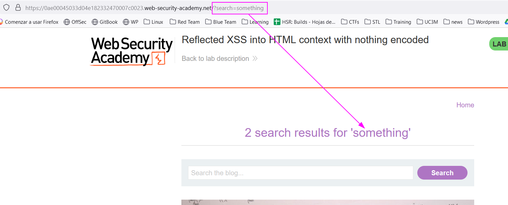
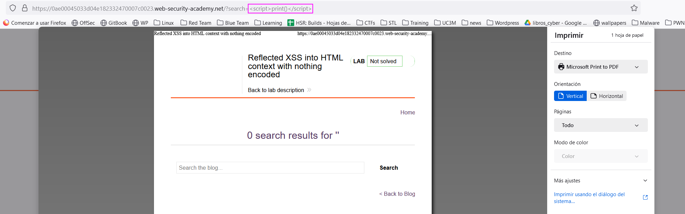
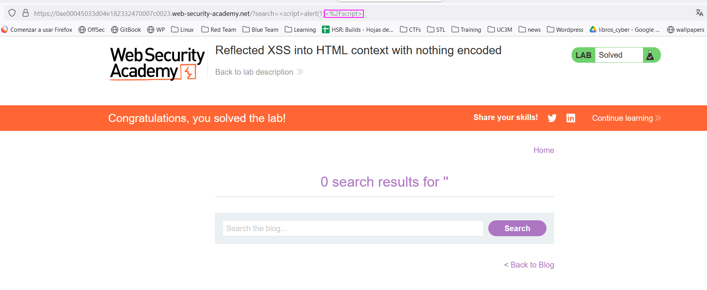

First version of reflected XSS. We are offered a webpage:

We might search for something and see if this content gets displayed:

It does get displayed in the page and it is a parameter in the URL. We can send this URL to a person and the content in the `search` variable will be rendered. Let's add a script:
`https://0ae00045033d04e182332470007c0023.web-security-academy.net/?search=%3Cscript%3Eprint()%3C/script%3E`
This indeed gets executed:

Note that if we append the script in the search bar, the slash `/` gets encoded as `%2F`:

