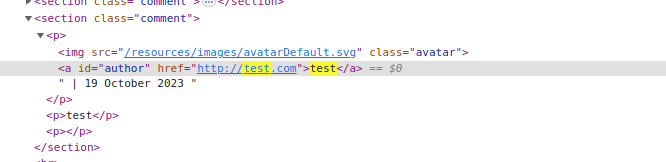
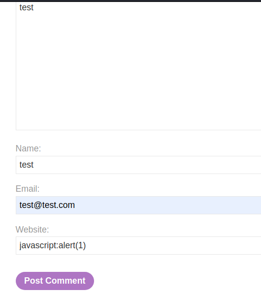
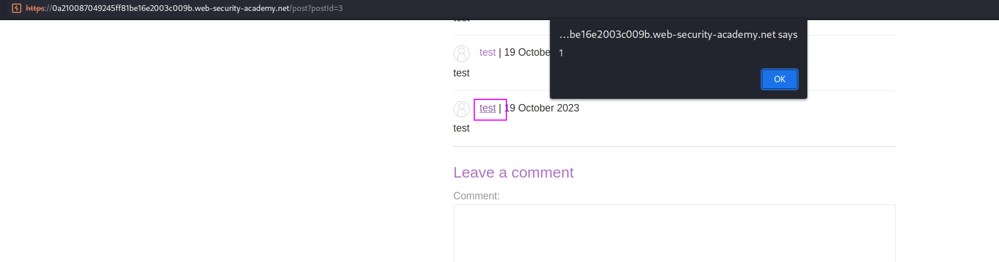

As we have seen, we can execute XSS inside the `href` attribute tith the `javascript` keyword. First, we have to see the `href` attribute that accepts our input:

We have it: it's the `website`.
We now have to submit a comment that calls `alert` when the name is clicked. For that, we just a basic payload: ``javascript:alert(1)``.

Submitting the content, has our payload stored in the `href` attribute. This means that, when clicking `href`, our script will be executed:

Remember we have to click the payload. Probably this script won't be the way to go in the exam.