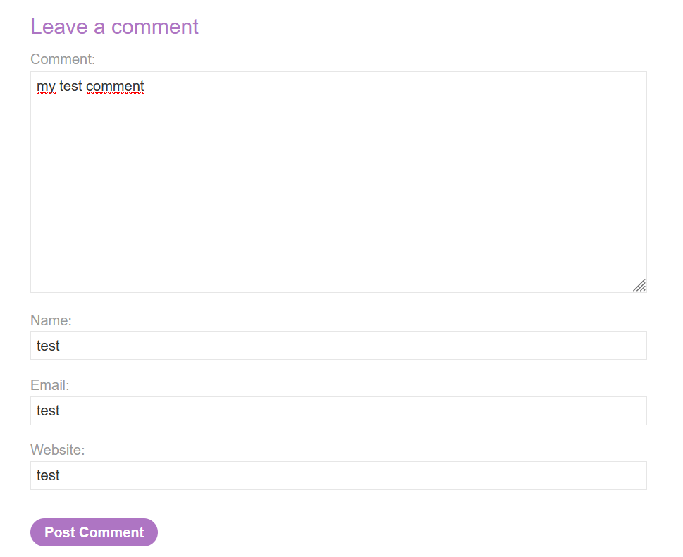
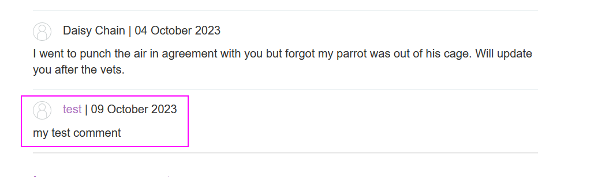
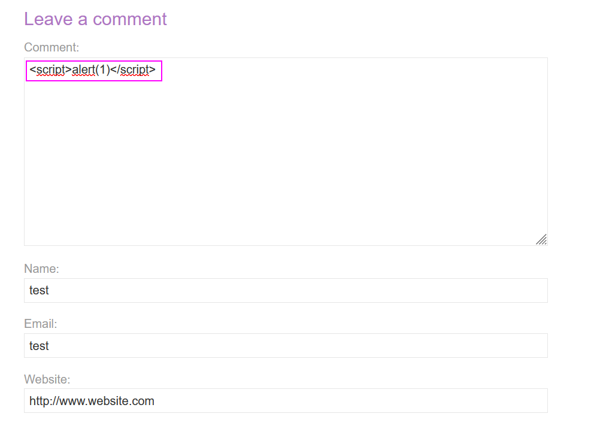
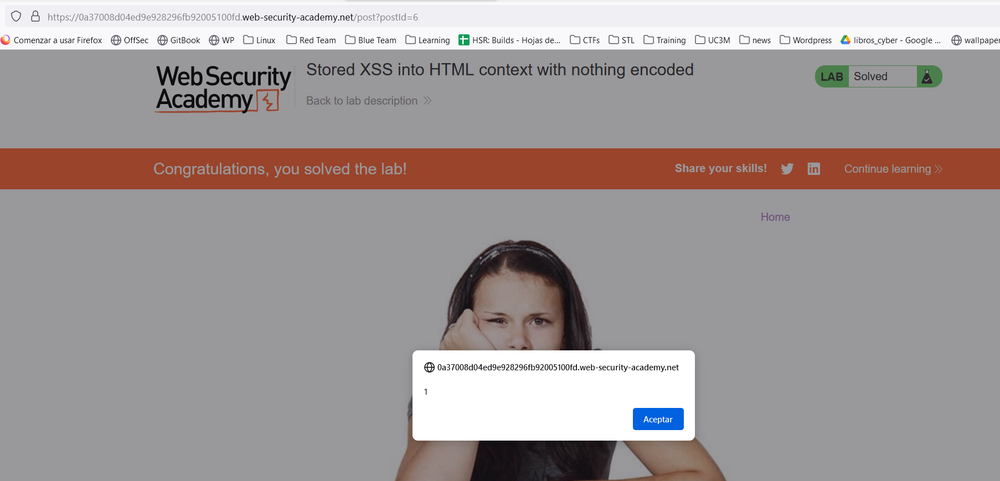

Base version of Stored XSS.
We have the website that allows us adding comments in posts (hmm, they get stored and then displayed):

This gets publicly displayed, so we can append a JavaScript payload and see if it gets rendered:

Now, each time we load the page of comments, the script gets rendered:

